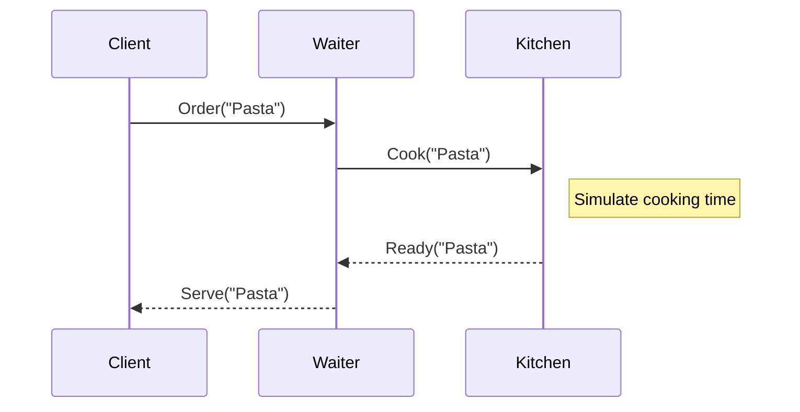

# Bright Future

## Now that we have immutable data types and pure functions, concurrency should be much easier right?

---

# Bright Future

<<< ../snippets/Futures.scala#examples scala {1|3-6|8-10|12-15|*}{lines:true}

<!-- 

Let's not mention the problem of referential transparency yet, we'll come back to it in CE/ZIO section

At this point it's enough to say that immutability, functions as first class citizens and concurrency primitives 
played very well together and it was tempting to use them for large scare concurrent systems

This snippet could be better, treat it as a placeholder


# How Scala helped

- 2004-2012 Java++, how Scala helped there
- Immutability (built-in collections)
- Case classes
- Pure functions
- `Option` (handling nulls) (vs Optional Java 1.7)
- `Future` (it’s a “lots of hand waving” Monad)

może powinniśmy zamienić ten slajd na jakiś wrapup + timeline
-->


<!-- ---  -->

<!-- # Code example: testing Futures -->

<!-- TODO: testing using type parameters, ID monad from Scalaz/early Cats, perhaps difficulty of handling state? -->

<!-- 

Może ten przykład z testowaniem pokazać jako uzasadnienie pomysłu z CE/ZIO zamiast przed samą akką?

-->

<!--
Transition: FUTURE -> concurrency -> Akka Actors
We have immutability, pure functions, concurrency should be simple now, right? Right? (pic)
Problems designing and programming
Hanging Futures
One-off jobs 
What about the state?
-->

<!-- 
# Side-note: Spark ???
- Google map-reduce (referencing streams)
- Pure functions
- Hard to test
- But… Scala got popular because of it
- FP programmers took advantage of Spark to promote itself


# Akka Actors (2012)
- Shared mutable state
- Everyone dreams big 
- Scala got even more popular because of it
- FP programmers took advantage of Spark to promote itself
- Code examples: free monad-based Akka actors  -->

---

# Futures are nice, but I need to manage state!

What if I need to concurrently modify the state?

<v-clicks>

<<< ../snippets/FutureStateProblem.scala#examples scala {1|9|3-7|*}{lines:true}

</v-clicks>

---

# How do we fix that?


<v-clicks>

There's one famous solution out there

</v-clicks>

---
background: /actors_collage.jpg
layout: center
---

# Actors!

## (Scala loves Erlang)

--- 
layout: center
---

# ~~Who's~~ What's an Actor anyway?

---

# Inbox and state management


<v-clicks>

* Actor has a message box and internal state
* It's logic is triggered by sending message
* Actor can occupy **one** or **zero** threads
* `Actor system` provides the runtime
* `Actor system` can be a cluster

</v-clicks>

---

# They can cooperate!

<!-- images from https://www.theserverside.com/blog/Coffee-Talk-Java-News-Stories-and-Opinions/How-the-Actor-Model-works-by-example -->


<!-- https://itknowledgeexchange.techtarget.com/coffee-talk/files/2023/12/understanding_the_actor_model-f.png more advanced example -->


---

# Actors in Akka/Pekko

<div class="absolute top-25 w-200">



</div>

---

# Actors in the Kitchen

<div class="absolute top-25 w-200">

<<< ../snippets/ActorsKitchen.scala scala {*}{maxHeight:'420px',lines:true}

</div>

---


# Problems with Akka-based design

<small>(that Scala devs encountered)</small>

<v-clicks>

- Navigation, discoverability
- One big actor or many small ones
- Lifetime
- More generally: testing…

</v-clicks>

<!---
Transition: Problems with Akka-based design
Problems:
- Navigation, discoverability
- One big actor or many small ones
- Lifetime
- More generally: testing…
-->

---

# Meanwhile...

### The community is flirting with various approaches to state management

<v-clicks>

- Actors
- State Monad
- Monad transformers
- Offloading state entirely to the database.

</v-clicks>

<v-click>
Let's give them a quick look
</v-click>

---

# State Monad

Put simply, it's a way to chain mutations of a value.


---

# State Monad

Here's how state monad is defined

<<< ../snippets/StateMonad.scala#stateMonadClass scala {1-3|5-9|*}{lines:true}

---

# State Monad

You can manipulate the state using helpers

<<< ../snippets/StateMonad.scala#stateMonadObject scala {*}{lines:true}

---

# State Monad

<<< ../snippets/StateMonad.scala#stateMonadMain scala {*}{lines:true}

---

# State Monad

Looks fun but we async and parallelism are not included

---

# Monad transformers

<div class="absolute top-25 w-200">

<<< ../snippets/StateTExample.scala#example scala {1|10-16|3-9|*}{lines:true}

</div>

---

# Monad transformers are leaky

<div class="absolute top-25 w-200">

There's a lot of lifting 🏋️

```scala {6}{lines:true}
def doLiftedAsyncComputation() = {
  val work = Future {
    Thread.sleep(10) // simulate doing the work
    21
  }
  StateT.liftF[Future, Int, Int](work)
}
```

<v-click>

It can go as ridiculous as

```scala
type AppStack[A] = EitherT[StateT[Future, AppState, *], AppError, A]
```

</v-click>

</div>

<v-click>

<div class="absolute bottom-20 w-200">

## Was simple `Future` that bad? 🤔

</div>

</v-click>


--- 
background: /world-if.webp
layout: center
---

# World if `Future` was a monad
<!-- # What was so bad about the `Future` anyway? -->

<!--  -->


---

# What would we like to have instead?

- IO!


<!-- # Side note: Twitter Stack / Linkerd ???
- Twitter Future early adoption
- Problem: built-in Scala Future was more popular
- Long-standing problem in Scala: FP vs Java++
  - At least two groups of programmers pulling Scala in their own preferred direction 
    - Future vars 
    - Later: pure FP vs casual FP (https://softwaremill.com/what-is-functional-programming/) -->

--- 

# Functional techniques

### Scala loves Haskell

- Cats / Monix
- Scalaz
- ZIO
- Cats Effect IO


<div>
But we still have: Future, Twitter Future, some Actors
</div>

---
layout: center
background: /galaxy-brain.jpg
---

# IO - the ultimate separation of concerns

---

# IO - the ultimate separation of concerns

<<< ../snippets/FutureVsIO.scala#example scala {1-5|7-11|13-14|*}{lines:true}

---

# How is it better than MTL?

<<< ../snippets/IORefExample.scala#example scala {3-9|1|11-15|*}{lines:true}

<v-click>

<div class="absolute bottom-15 w-200">

### Everything is wrapped with `IO`

</div>

</v-click>

---

# But I like my other IO monad better!

`cats.effect.IO` is just one implementation, we should abstract it!

---
layout: center
background: /galaxy-brain-expanded.jpg
---

# Final tagless - the final abstraction


---

# Final tagless

<div class="absolute top-25 w-200">

<<< ../snippets/TaglessRefExample.scala#tagless scala {1-4,15-18|6-13,20-32|*}{maxHeight:'420px',lines:true}

</div>

---


TODO: Add Kyo slide

<!---


TODO: chyba warto tu pokazać kawałek Kyo które robi algebraic effects, podlinkować talk wprowadzający https://www.youtube.com/live/gYS3UkmFoHQ?t=719&cbrd=1

-->
