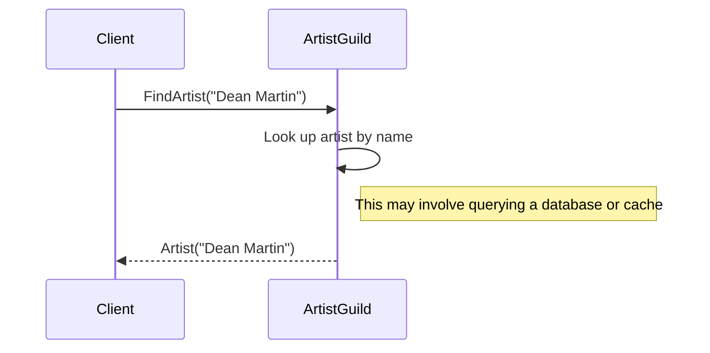
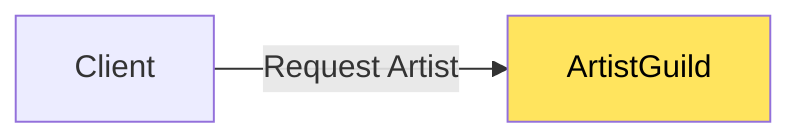
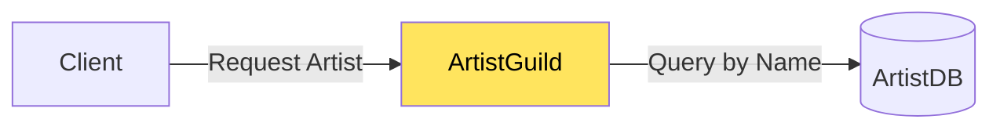
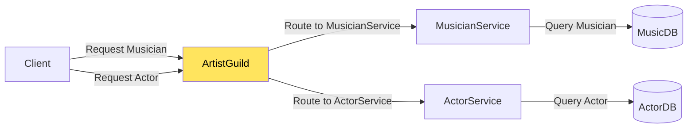

# Bright `Future`

Now that we have: 
- immutable data types 
- pure functions

<v-clicks>


concurrency should be much easier right?

 

 <span class="absolute bottom-20 right-20 text-4xl font-bold bg-white text-black rotate-335">YES!</span>

</v-clicks>


---

# Bright `Future`

<span class="absolute top-17 right-10 text-4xl font-bold text-yellow rotate-10">2010 / 2013</span>
<span class="absolute top-12 right-5 text-xl font-bold text-yellow rotate-10">Twitter / stdlib</span>

<<< ../snippets/Futures.scala#examples scala {1-8|12-16|18-21|*}{lines:true}

<!-- 

Let's not mention the problem of referential transparency yet, we'll come back to it in CE/ZIO section

At this point it's enough to say that immutability, functions as first class citizens and concurrency primitives 
played very well together and it was tempting to use them for large scare concurrent systems

This snippet could be better, treat it as a placeholder


# How Scala helped

- 2004-2012 Java++, how Scala helped there
- Immutability (built-in collections)
- Case classes
- Pure functions
- `Option` (handling nulls) (vs Optional Java 1.7)
- `Future` (it’s a “lots of hand waving” Monad)

może powinniśmy zamienić ten slajd na jakiś wrapup + timeline
-->


<!-- ---  -->

<!-- # Code example: testing Futures -->

<!-- TODO: testing using type parameters, ID monad from Scalaz/early Cats, perhaps difficulty of handling state? -->

<!-- 

Może ten przykład z testowaniem pokazać jako uzasadnienie pomysłu z CE/ZIO zamiast przed samą akką?

-->

<!--
Transition: FUTURE -> concurrency -> Akka Actors
We have immutability, pure functions, concurrency should be simple now, right? Right? (pic)
Problems designing and programming
Hanging Futures
One-off jobs 
What about the state?
-->

<!--
We are using the std lib Future. Type that represents a value that may be available in the future (like fetching from a DB).

flatMapping ("computation chaining") allows us to work on a value that is not yet available which was a revolutionary idea in mainstream languagues back then. 

every modern language has a type like this but it wasn't the case in 2010.
-->

---

# Futures are nice, but I need to manage state!

What if I need to concurrently modify the state?

<v-clicks>

<<< ../snippets/FutureStateProblem.scala#examples scala {1|3-7|9|*}{lines:true}

</v-clicks>


<v-click>

<span class="absolute top-30 left-100 text-4xl font-bold bg-white text-black rotate-4">
What will the final value be?
</span>

</v-click>


<!--
TODO: can we simplify?

ask the audience what is the final counter result here

in Scala (since it's a JVM language) we also have a posibility to use the synchronized keyword to guard access to critical section (monitor-based synchronization).
-->

---

# How do make it **safer**?


<v-clicks>

There's one famous solution out there

</v-clicks>

---
background: /actors_collage.jpg
layout: center
---

# Actors!

## (Scala loves Erlang)

--- 
layout: center
---

# ~~Who's~~ What's an Actor anyway?

---

# Inbox and state management


<span class="absolute top-17 right-10 text-4xl font-bold text-yellow rotate-10">2006 / 2009</span>
<span class="absolute top-12 right-5 text-xl font-bold text-yellow rotate-10">stdlib / Akka</span>


<v-clicks>

* Actor has a message box and internal state
* It's logic is triggered by sending message
* Actor can occupy **one** or **zero** threads
* `Actor system` provides the runtime
* `Actor system` can be a cluster

</v-clicks>

---

# Actors in Akka/Pekko

<<< ../snippets/CounterActor.scala#CounterActor scala {2-5|7-13|15|*}{lines:true}


---

# Artists Guild




---

# Artists Guild - components



---

# Artists Guild - with database





---

# Artists Guild - smaller actors





---


# Problems with Akka-based design

<small>(that Scala devs encountered)</small>

- Navigation, discoverability

<div v-click.hide="+1" class="absolute top-25 right-5 border-solid border-gray border-2">
<<< ../snippets/CounterActor.scala#CounterActor scala {2-13}
</div>

<span v-click.hide="+1" class="absolute top-20 right-10 text-4xl font-bold bg-white text-black rotate-5">INCONVENIENCE</span>

<v-click>

- One big actor or many small ones 

</v-click>

<v-click>
 
</v-click>
<v-click>
<div class="absolute bottom-10 right-10 w-100 h-50" style="background: url('/the-rock-small-actor.jpg') repeat;"></div>
</v-click>
<v-clicks>

- Lifecycle
- More generally: testing…

</v-clicks>

<!--
- coming back from IDE and summarizing

we'll come back to testing problems with actor systems later on
-->

---

# Meanwhile...

<v-clicks>

* Some say state management is the biggest issue with `Future`s

* Others blame the **eager evaluation**

</v-clicks>


<!--
-->

---

# Meanwhile... Futures eager evaluation

<<< ../snippets/FuturesEagerEval.scala#examples scala {1-9|11-14|*}{lines: true}


<v-click>
<!-- t=${Date.now()} is a clever hack to ensure the browser loads the image right when it is displayed, to make sure it starts from t=0 on click-->

</v-click>

<v-click>

<div class="absolute bottom-15 right-20 border-solid border-gray border-2">

```{1,4-6}
$ scala FuturesEagerEval.scala 
Compiling project (Scala 3.6.2, JVM (17))
Compiled project (Scala 3.6.2, JVM (17))
done x
done y
The result is 42
```

</div>

</v-click>

<!--
-->


--- 
background: /world-if.webp
layout: center
---

# World if `Future` was a monad

(Scala loves Haskell)
<!-- # What was so bad about the `Future` anyway? -->

<!--  -->


<!--
# Side note: Twitter Stack / Linkerd ???
- Twitter Future early adoption
- Problem: built-in Scala Future was more popular
- Long-standing problem in Scala: FP vs Java++
  - At least two groups of programmers pulling Scala in their own preferred direction 
    - Future vars 
    - Later: pure FP vs casual FP (https://softwaremill.com/what-is-functional-programming/)
-->


---

# IO - the ultimate separation of concerns

<span class="absolute top-17 right-10 text-4xl font-bold text-yellow rotate-10">2013</span>
<span class="absolute top-5 right-10 text-xl font-bold text-yellow rotate-10">Scalaz</span>

Think `Future` but lazy

<<< ../snippets/FutureVsIO.scala#example scala {1-5|7-11|13-14|*}{lines:true}


---

<span class="absolute top-20 left-50">
<strong>Me:</strong> IO monad sounds great great!
</span>

<v-click>

<span class="absolute top-30 right-45">
<strong>Me to me:</strong> Write your own IO monad!
</span>


</v-click>

<v-clicks>


<span class="absolute top-[40%] left-[40%] text-4xl font-bold text-yellow-400 rotate-2">Scalaz</span>

<span class="absolute top-[60%] left-[55%] text-4xl font-bold text-yellow-400 rotate-10">Monix</span>

<span class="absolute top-[30%] left-[55%] text-4xl font-bold text-yellow-400 rotate-5">Cats Effect</span>

<span class="absolute top-[55%] left-[45%] text-4xl font-bold text-yellow-400 rotate-350">ZIO</span>

<span class="absolute top-[65%] left-[70%] text-4xl font-bold text-yellow-400 rotate-5">Kyo</span>

<span class="absolute top-[75%] left-[45%] text-4xl font-bold text-yellow-400 rotate-355">Yaes</span>


</v-clicks>


---

# Cats Effect


<span class="absolute top-17 right-10 text-4xl font-bold text-yellow rotate-10">2017</span>

<<< ../snippets/IOCounterExample.scala#example scala {*}{lines:true}
<!-- <<< ../snippets/IORefExample.scala#example scala {5-11|1-3|2|13-17|*}{lines:true} -->


<v-after>

<div class="absolute bottom-20 right-20 text-2xl bg-white text-black rotate-5 border-solid border-black border-1">

Featuring
* Queues
* Atomic Ref
* Resource management
* and more

</div>

</v-after>

<!--
no lifting! just a composition of values and a single type

Speaker B: but one problem that we had with MTL is still there: one monad for the whole application (everyone needs to adhere to it, even external libs!) 

(it can be tackled with some discipline but it rarely happens in big dynamically developed projects)
-->

---
layout: center
---

# Effects are cool

but they are not the only monads

---
src: ./state.md
---


# But I like my other IO monad better!

So `cats.effect.IO` is just one implementation, we should abstract it!

<!--
For example: there were experiments with an IO monad that has an explicit error type (IO used here has a fixed JVM Throwable error type which wasn't good enough for some programmers).

Everyone was writing their own IO monad.
-->

---
layout: center
background: /galaxy-brain.jpg
---

# Final tagless - the final abstraction


---

# Final tagless

<span class="absolute top-17 right-10 text-4xl font-bold text-yellow rotate-10">2015~2017</span>

<<< ../snippets/TaglessFinalArtists.scala#interface scala {*}{lines:true}


<v-click>


<div class="absolute right-30 bottom-10 flex flex-col items-center p-7 rounded-2xl bg-black shadow-xl w-100">
  <div class="flex">
    <span class="text-2xl font-medium text-white">Let's write generic and add "runtime" later</span>
  </div>
  <div>
    
  </div>
</div>


</v-click>


---

# Final tagless

<!-- <<< ../snippets/TaglessFinalJourney.scala#partial-implementation scala {*}{lines:true} -->
<<< ../snippets/TaglessFinalArtists.scala#mtl-implementation scala {*}{lines:true}

<v-click>

<<< ../snippets/TaglessFinalArtists.scala#zio-implementation scala {*}{lines:true}

</v-click>

<v-click>

<div class="absolute bottom-2 right-20 text-2xl bg-white text-black rotate-5 border-solid border-white border-10">

Featuring

✅ Testability

✅ Composability

✅ Choice

❌ Readability

❌ Cognitive load


</div>

</v-click>


---

# What the `F[_]`

<v-click>

<!-- Speaker A: Everyone was supposed to be happy!  -->

Everyone was supposed to be happy!

</v-click>

<!-- you should've be able to decide for MT or beefy effect to your preference, at the end of the world -->
<v-click>

<!-- Speaker B: You telling me -->

You telling me I now need `F[_]: Async: Monad: Clock: UUIDGen` to run hello world?

  
</v-click>

<v-click>

<!-- Speaker A: let's save the discussion for later and move on to something practical -->

<span class="absolute bottom-10 left-20 text-4xl font-bold bg-white text-black rotate-5">We'll get back to that</span>

</v-click>

