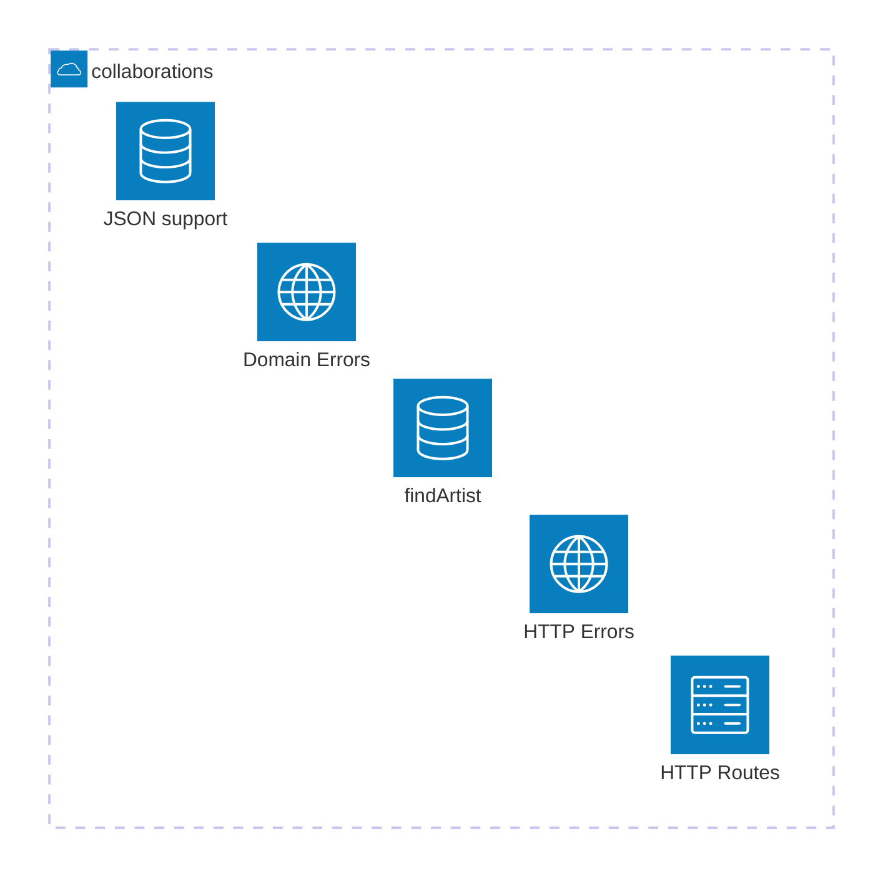

# Can I even use all of this in practice?

All these techniques had their impact on how Scala devs developed software. Let's go very quickly through some examples and see how the code looked like and what developers focused on.

---

# HTTP

For every startup, the most important decision is what web framework to use (and we all know that if a startup fails it's 100% fault of the wrong web framework).

---

# HTTP

We will not go through every possible web framework for Scala, just couple of them that had the most impact. And since we already talked about actors, the best way to start with HTTP is to mention a singer.

---
background: /sinatra.jpg
layout: center
---

# ~~Sinatra~~ Scalatra

## (Scala loves Ruby)

<!--
Scala loves Ruby
-->

---

# Scalatra

Scalatra is a simple, accessible and free web micro-framework.

It combines the power of the JVM with the beauty and brevity of Scala, helping you quickly build high-performance web sites and APIs.

Ported from Ruby.

<!--
Let's see how it works in action.
-->

---

# Example: Artist collaborations

Implement an API which returns an information whether two given artists could have collaborated with each other.

E.g.

```
> curl http://localhost:8080/collaboration?artist1=Frank Sinatra&artist2=Aretha Franklin
Frank Sinatra and Aretha Franklin could have collaborated between 1954 and 1995%
```

---

# The idea: create a web app as quickly as possible

```ruby
require 'sinatra'

get '/' do
  'Hello world!'
end
```

<!--
This is how a hello world looks in ruby. There's nothing more, you can just run this and it works.
-->

---

# The idea: create a web app as quickly as possible

<<< ../projects/scalatra/src/main/scala/example/helloworld.scala#example scala {*}

<!--
And this is how it's ported to Scala.
-->

---

# The artist collaboration implementation

````md magic-move
```scala
case class Artist(name: String, startYear: Int, endYear: Int)
```
```scala
case class Artist(name: String, startYear: Int, endYear: Int)

class CollaborationServlet extends ScalatraServlet {
  get("/collaboration") {
    ""
  }
}
```
```scala
case class Artist(name: String, startYear: Int, endYear: Int)

class CollaborationServlet extends ScalatraServlet {
  get("/collaboration") {
    val artist1 = findArtist(params.getOrElse("artist1", halt(400, "Missing parameter: artist1")))
    val artist2 = findArtist(params.getOrElse("artist2", halt(400, "Missing parameter: artist2")))
    ""
  }

  // this simulates a side-effectful call: example of an API or a DB call
  def findArtist(name: String): Artist = {
    val artists: List[Artist] = {
      val json =
        Source
          .fromResource("artists.json")
          .mkString
      parse(json).extract[List[Artist]]
    }

    artists
      .find(_.name == name)
      .getOrElse(halt(404, s"Artist $name not found"))
  }
}
```
```scala
case class Artist(name: String, startYear: Int, endYear: Int)

class CollaborationServlet extends ScalatraServlet with JacksonJsonSupport {
  protected implicit lazy val jsonFormats: Formats =
    DefaultFormats.withBigDecimal

  get("/collaboration") {
    val artist1 = findArtist(params.getOrElse("artist1", halt(400, "Missing parameter: artist1")))
    val artist2 = findArtist(params.getOrElse("artist2", halt(400, "Missing parameter: artist2")))

    checkCollaboration(artist1, artist2)
  }

  // this simulates a side-effectful call: example of an API or a DB call
  def findArtist(name: String): Artist = { ... }
}
```
````

<!--
-->

---

# It's quick and simple

<v-clicks>

- small library
- up and running very quickly
- batteries (servlets) included

</v-clicks>

---

# It's pragmatic but...

Pragmatism isn't always the best option! This simple, quick approach comes with a heavy baggage.

<!--
servlets... really?
-->


---

# You don't know what's side-effectful

```scala
class CollaborationServlet extends ScalatraServlet with JacksonJsonSupport {
  protected implicit lazy val jsonFormats: Formats = DefaultFormats.withBigDecimal

  get("/collaboration") {
    val artist1 = findArtist(params.getOrElse("artist1", halt(400, "Missing parameter: artist1")))
    val artist2 = findArtist(params.getOrElse("artist2", halt(400, "Missing parameter: artist2")))
    checkCollaboration(artist1, artist2)
  }

  def findArtist(name: String): Artist = {
    val artists: List[Artist] = {
      val json =
        Source
          .fromResource("artists.json")
          .mkString
      parse(json).extract[List[Artist]]
    }
    artists
      .find(_.name == name)
      .getOrElse(halt(404, s"Artist $name not found"))
  }
}
```

<!--
Additionally, when we needed JSON, we needed to extend our servlet with the `JsonSupport` trait
-->

---
layout: full
---

# e.g., JSON Support?

```scala {*|1,16}
class CollaborationServlet extends ScalatraServlet with JacksonJsonSupport {
  protected implicit lazy val jsonFormats: Formats = DefaultFormats.withBigDecimal

  get("/collaboration") {
    val artist1 = findArtist(params.getOrElse("artist1", halt(400, "Missing parameter: artist1")))
    val artist2 = findArtist(params.getOrElse("artist2", halt(400, "Missing parameter: artist2")))
    checkCollaboration(artist1, artist2)
  }

  def findArtist(name: String): Artist = {
    val artists: List[Artist] = {
      val json =
        Source
          .fromResource("artists.json")
          .mkString
      parse(json).extract[List[Artist]]
    }
    artists
      .find(_.name == name)
      .getOrElse(halt(404, s"Artist $name not found"))
  }
}
```

<!--
Additionally, when we needed JSON, we needed to extend our servlet with the `JsonSupport` trait
-->

---

# Every integration (JSON, DB, ...) is coupled with Scalatra

```scala {*|1,4,12-14}
class CollaborationServlet extends ScalatraServlet with JacksonJsonSupport with FutureSupport {
  protected implicit lazy val jsonFormats: Formats = DefaultFormats.withBigDecimal

  def db: Database

  get("/collaboration") {
    val artist1 = findArtist(params.getOrElse("artist1", halt(400, "Missing parameter: artist1")))
    val artist2 = findArtist(params.getOrElse("artist2", halt(400, "Missing parameter: artist2")))
    checkCollaboration(artist1, artist2)
  }

  get("/artists") {
    db.run(Tables.getMostActiveArtists.result)
  }

  // ...
}
```

<!--
the list of extended traits grows, people tried to tame this growth by trying different decoupling, injection strategies but the complexity was still there

SpeakerB: Why do you need FutureSupport here?
-->
---

# And this all affects testability

```scala
class ScalatraServletTests extends ScalatraFunSuite {

  addServlet(classOf[CollaborationServlet], "/*")

  test("GET /collaboration") {
    get("/collaboration", params = Map("artist1" -> "ArtistA", "artist2" -> "ArtistB")) {
      status should equal(200)
      body should equal(
        "ArtistA and ArtistB could have collaborated between 1985 and 1992"
      )
    }
  }
}
```

<!--
You usually end up testing your logic together with the HTTP, JSON, DB layer because the tool guides you this way.
-->

---

# And this all affects testability

```scala {1}
class ScalatraServletTests extends ScalatraFunSuite {

  addServlet(classOf[CollaborationServlet], "/*")

  test("GET /collaboration") {
    get("/collaboration", params = Map("artist1" -> "ArtistA", "artist2" -> "ArtistB")) {
      status should equal(200)
      body should equal(
        "ArtistA and ArtistB could have collaborated between 1985 and 1992"
      )
    }
  }
}
```

```scala
trait ScalatraSuite extends Suite with ScalatraTests with BeforeAndAfterAll with Matchers {
  override protected def beforeAll(): Unit = start()
  override protected def afterAll(): Unit = stop()
}
```

<!--
You need to have a server running to test most of your stuff. It takes a lot of discipline to be able to decouple your logic into small pure functions to avoid that.
Also decoupling the web parts, the stateful/DB parts, the JSON parsing parts, are all hard because of that.
-->

---

# Convenience vs Safety


<!--
Even if Scala devs didn't know it back then, all the discussions, including the one I am bringing up right now were instances of a bigger debate: what's more important: convenience or safety?
-->

---

# Convenience vs Safety: Scalatra


## Convenience
- everything in one place <hugeicons-happy/>
- easy to quickly write something that works <hugeicons-happy/>

## Safety
- based on well-tested tech (servlets) <hugeicons-happy/>
- many stable integrations <hugeicons-happy/>

<!--
In case of Scalatra, we can see a lot of benefits in both categories. 
-->

---

# Convenience vs Safety: Scalatra


## Convenience
- <span style="color: gray">everything in one place <hugeicons-happy/></span>
- <span style="color: gray">easy to quickly write something that works <hugeicons-happy/></span>
- dealing with servlets everywhere (even in tests) <hugeicons-unhappy/>

## Safety
- <span style="color: gray">based on well-tested tech (servlets) <hugeicons-happy/></span>
- <span style="color: gray">many stable integrations <hugeicons-happy/></span>
- in bigger apps: hard to write something that works correctly <hugeicons-unhappy/> <hugeicons-unhappy/> <hugeicons-unhappy/>

<!--
maybe it's quick to write something, but it's usually not that quick to write something that works correctly (or change something bigger without introducing bugs)
-->


---

# Convenience = Tight Coupling = Less Safety



<!--
Scala devs were learning the hard way about the real price of convenience. It's easy to start, you get the reward early on but when the project grows, it gets less and less convenient: the changes are difficult to make, the project gets messier, there are more bugs, the tests take a long time, they are less stable, people start quitting. Nothing convenient about these things.
-->

---

# Is this the way?


<!--
That's why safety started to be the top priority among many of us. We wanted to be safer in bigger projects, making changes with more confidence, having a more stable dev environments. So, in a way we wanted another type of convenience, a long-term one. And that means, we needed to separate the concerns, decouple things that shouldn't be coupled together.

Not all tools encouraged this which unfortunately created some friction.
-->

---

# More decoupling

<<< ../projects/scalatra/src/main/scala/example/servlet.scala#findArtist scala {*}

<!-- 
For example, our HTTP service coupled the persistence layer and the HTTP layer.
So, to gain more long-term safety, we needed to start decoupling HTTP errors from the logic itself. So, instead of:
-->

---

# More decoupling using FP

<<< ../projects/pekko-http/src/main/scala/persistence.scala#findArtist scala {4-11|*}

<!--
we needed to start using more FP features, putting the constraints to the signature, decoupling domain errors from HTTP errors.
-->

---

# Meanwhile... more asynchrony

<div class="absolute top-30 left-40 flex flex-col items-center p-7 rounded-2xl bg-black shadow-xl w-100">
  <div class="flex">
    <span class="text-2xl font-medium text-white">Futures everywhere</span>
  </div>
  <div>
    
  </div>
</div>

<!--
Additionally, as we previously talked about, Futures and asynchrony gained a lot of traction. Everything needed to be asynchronous.

Why not use their inherent asynchrony to run HTTP servers? Scalatra supported Futures, but many devs moved to something else.
-->

---

# Meanwhile... actors

<div class="absolute top-30 left-40 flex flex-col items-center p-7 rounded-2xl bg-black shadow-xl w-100">
  <div class="flex">
    <span class="text-2xl font-medium text-white"><strike>Futures</strike> actors everywhere</span>
  </div>
  <div>
    
  </div>
</div>

<!--
Since people started using actors to design their asynchronous systems, they also wanted their HTTP servers to run on actors.

Why not use their inherent asynchrony to run HTTP servers?
-->

---

# Meanwhile... new DSLs

<div class="absolute top-30 left-40 flex flex-col items-center p-7 rounded-2xl bg-black shadow-xl w-100">
  <div class="flex">
    <span class="text-2xl font-medium text-white">New DSLs everywhere</span>
  </div>
  <div>
    
  </div>
  <div class="flex">
    <span class="text-l font-medium text-gray">(Scala devs love DSLs)</span>
  </div>
</div>


<!--
and that meant we were able to create a new DSL for HTTP along the way!
-->

---

# New paradigm = New DSL

<<< ../projects/pekko-http/src/main/scala/routes.scala#route scala {*|1|2-4|6-7|5-8,9-12}

<div v-click="3">
  <div class="absolute top-58 right-30 w-110 text-red-500 font-bold text-2xl text-center">Either[ArtistNotFound, Artist]</div>
</div>

<!--
That's how akka-http route definition looks like for our example artists app.

[click] The important bit is an endpoint became just a value which was something that helped with composability and readability. You can reason about values, in Scalatra you were calling methods that added endpoints to the servlet state. So that was much better already.

[click] That's how you define path, get request and, most importantly, parameters which are then extracted as function parameters with correct types.

[click] Then, since our persistence layer returns Eithers now...

[click] we can make decisions based on what is returned. So, domain errors are decoupled from HTTP errors. 

And that's the new DSL. However, as we said earlier, asynchrony was getting traction and we had actors at our disposal.
-->

---

# Actors and Futures are the foundation

<<< ../projects/pekko-http/src/main/scala/Server.scala#server scala {*}

// TODO: show how the route value is bound and that everything is run on actors, exposing Futures.

<!--
That's In this new approach, Futures and actors were the foundation.
-->

---

# So what's the problem?

<<< ../projects/pekko-http/src/main/scala/routes.scala#route scala {*|6-7}

<div v-click="1">
  <div class="absolute top-48 right-30 w-110 text-red-500 font-bold text-4xl text-center">SEQUENTIAL</div>
</div>

<!--
Just by doing that, we were able to quickly integrate the asynchronous actor-based systems with the HTTP layer, however we still needed to be vigilant about asynchrony.
-->

---

# Use Futures!

<<< ../projects/pekko-http/src/main/scala/routes.scala#asyncRoute scala {*}

<!--
Now we have two forces that drove us: being asynchronous and trying to be safe. This was getting complicated very quickly.
-->

---

# Use MTL!

<<< ../projects/pekko-http/src/main/scala/routes.scala#asyncRouteMTL scala {*}

<!--
And that meant we needed to step up our FP game. We want to work with Eithers, and the asynchronous Futures, together, but conveniently. Naturally, we went with Monad Transformers, here EitherT.
-->

---

# Use MTL!

<<< ../projects/pekko-http/src/main/scala/routes.scala#asyncRouteMTL scala {*}

<!--
We want to work with Eithers, not the asynchronous Futures, hence EitherT.
-->

---

# We did concurrency and HTTP

But a similar story can be told about:
- databases
- JSON libraries
- testing frameworks
- frontend (Scala.js)
- dependency management
- HTTP clients
- API integrations
- ...

<!--
testing: akka-testkit test problems, testing concurrent stuff is hard

next: Play gives you structure but not much more... (problems stay the same but in MVC world)

http4s: BYOB, batteries not included, bare bones, you have the control but also you have the decision paralysis 

holy grail: tapir

- HTTP
- Scala loves Python (Cask)
- Scala loves Ruby on Rails (Scalatra) - microframework
- Scala loves actors (Spray/Akka HTTP)
- Scala loves Spring (Play) Future and sometimes IO
- Scala loves FP (http4s) IO
- Scala loves types (tapir) final tagless done right (it's good for libraries, and it's good when it doesn't leak)
-->
