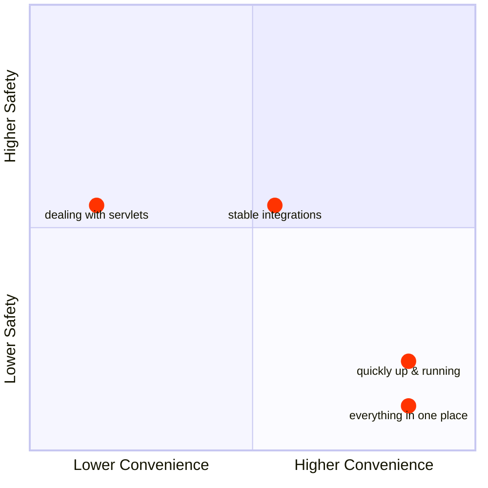
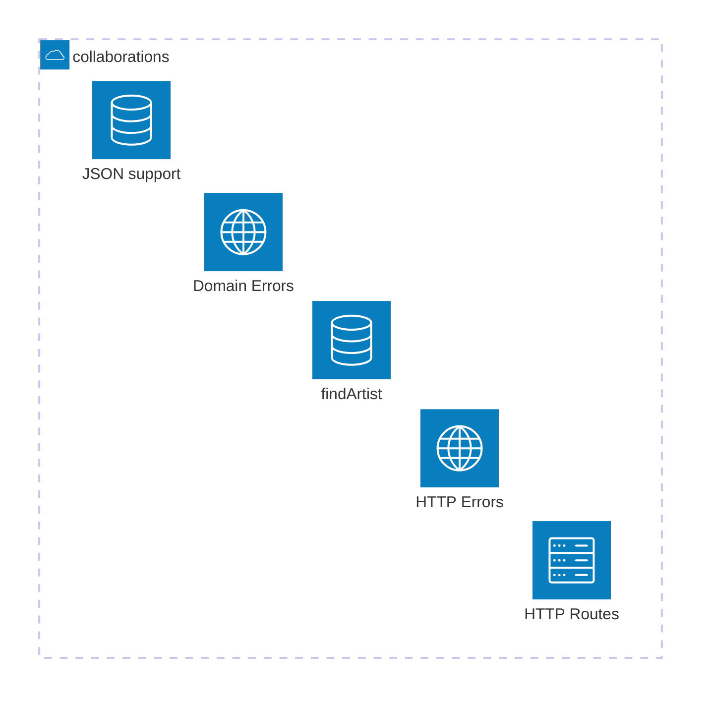
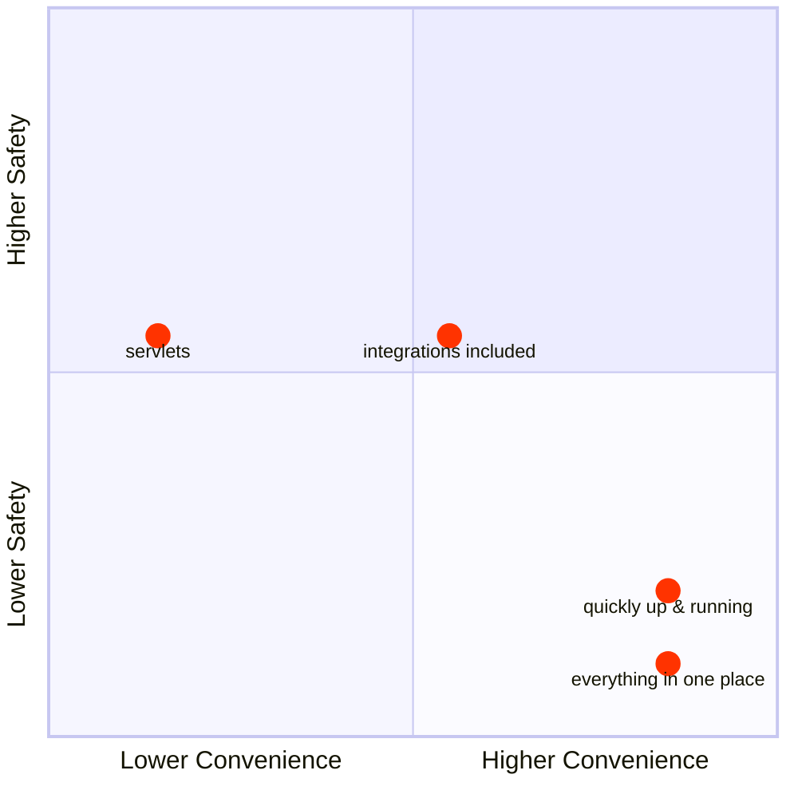
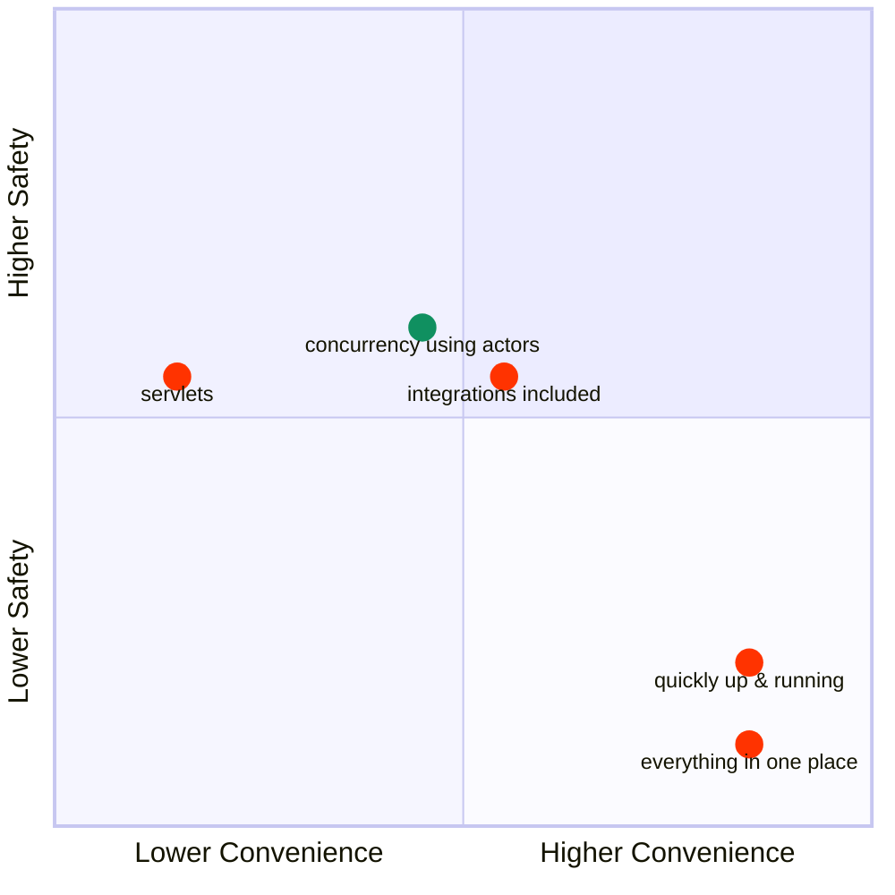
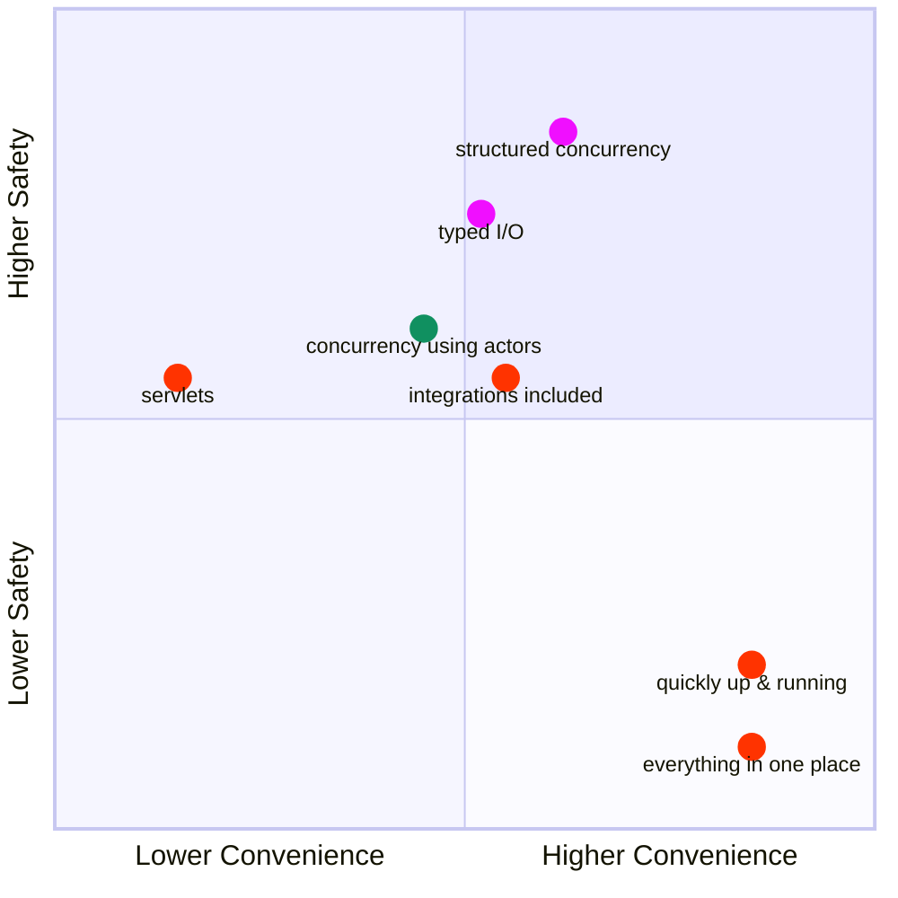
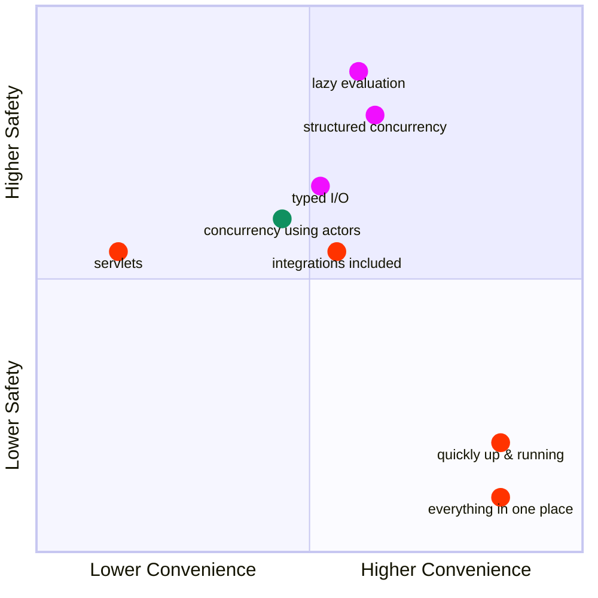
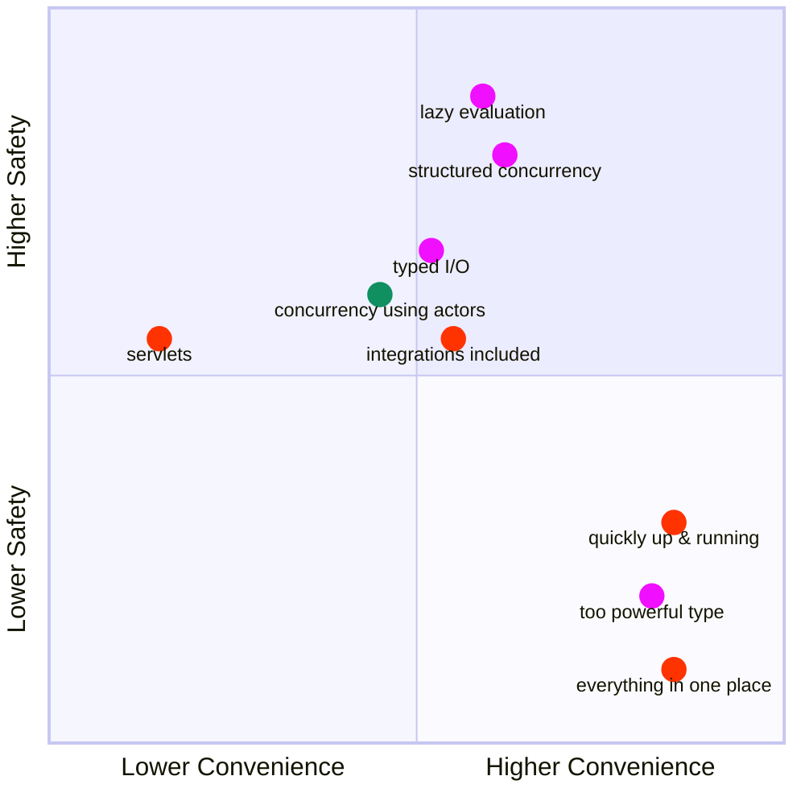
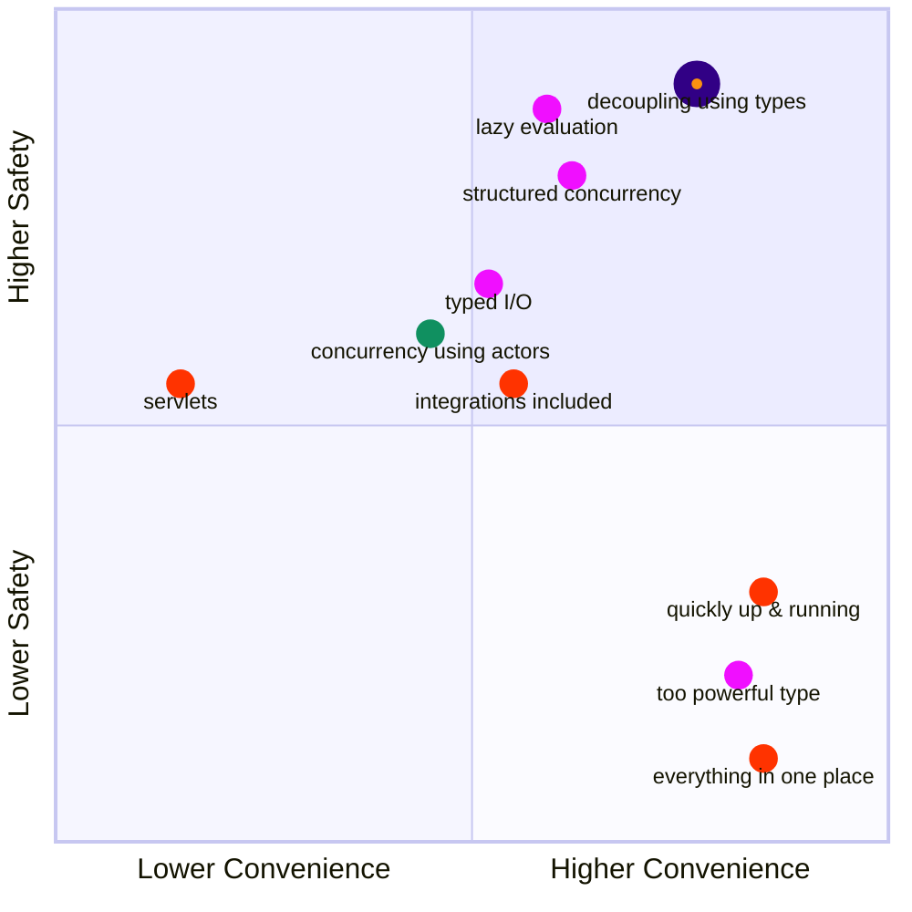

# Can I even use all of this in practice?
<!-- 
All these techniques had their impact on how Scala devs developed software. 

Let's go very quickly through some examples and see how the code looked like and what developers focused on. 

-->


<span class="absolute bottom-85 text-2xl font-bold bg-white text-black left-100">Fancy coding techniques</span>

---

# HTTP


<span class="absolute top-8 left-125 font-bold text-black ">
Making startup! First decision?!
</span>


<span class="absolute text-xs top-57 left-102 font-bold text-black ">
HTTP library
</span>


<span class="absolute text-xs top-57 left-128 font-bold text-black ">
JSON library
</span>


<span class="absolute text-xs top-60 left-160 font-bold text-black ">
Business case
</span>

<!-- 

For every startup, the most important decision is what web framework to use (and we all know that if a startup fails it's 100% fault of the wrong web framework). 


We will not go through every possible web framework for Scala, just couple of them that had the most impact. And since we already talked about actors, the best way to start with HTTP is to mention a singer.

-->


---
background: /sinatra.jpg
layout: center
---

# ~~Sinatra~~ Scalatra

## (Scala loves Ruby)

<!--
Scala loves Ruby
-->

---

# Scalatra

Scalatra is a simple, accessible and free web micro-framework.

It combines the power of the JVM with the beauty and brevity of Scala, helping you quickly build high-performance web sites and APIs.

Ported from Ruby.

<!--
Let's see how it works in action.
-->

---

# Example: Artist collaborations


<span class="absolute top-60 left-50 text-4xl font-bold bg-white text-black rotate-335">Could they work together?</span>

---

# Example: Artist collaborations

Implement an API which returns an information whether two given artists could have collaborated with each other.

E.g.

```
> curl http://localhost:8080/collaboration?artist1=Frank Sinatra&artist2=Aretha Franklin
Frank Sinatra and Aretha Franklin could have collaborated between 1954 and 1995%
```

---

# The idea: create a web app as quickly as possible

```ruby
require 'sinatra'

get '/' do
  'Hello world!'
end
```

<!--
This is how a hello world looks in ruby. There's nothing more, you can just run this and it works.
-->

---

# The idea: create a web app as quickly as possible

<<< ../projects/scalatra/src/main/scala/example/helloworld.scala#example scala {*}

<!--
And this is how it's ported to Scala.
-->

---

# The artist collaboration implementation

````md magic-move
```scala
case class Artist(name: String, startYear: Int, endYear: Int)
```
```scala
case class Artist(name: String, startYear: Int, endYear: Int)

class CollaborationServlet extends ScalatraServlet {
  get("/collaboration") {
    ""
  }
}
```
```scala
case class Artist(name: String, startYear: Int, endYear: Int)

class CollaborationServlet extends ScalatraServlet {
  get("/collaboration") {
    val artist1 = findArtist(params.getOrElse("artist1", halt(400, "Missing parameter: artist1")))
    val artist2 = findArtist(params.getOrElse("artist2", halt(400, "Missing parameter: artist2")))
    ""
  }

  // this simulates a side-effectful call: example of an API or a DB call
  def findArtist(name: String): Artist = {
    val artists: List[Artist] = {
      val json =
        Source
          .fromResource("artists.json")
          .mkString
      parse(json).extract[List[Artist]]
    }

    artists
      .find(_.name == name)
      .getOrElse(halt(404, s"Artist $name not found"))
  }
}
```
```scala
case class Artist(name: String, startYear: Int, endYear: Int)

class CollaborationServlet extends ScalatraServlet with JacksonJsonSupport {
  protected implicit lazy val jsonFormats: Formats =
    DefaultFormats.withBigDecimal

  get("/collaboration") {
    val artist1 = findArtist(params.getOrElse("artist1", halt(400, "Missing parameter: artist1")))
    val artist2 = findArtist(params.getOrElse("artist2", halt(400, "Missing parameter: artist2")))

    checkCollaboration(artist1, artist2)
  }

  // this simulates a side-effectful call: example of an API or a DB call
  def findArtist(name: String): Artist = { ... }
}
```
````

<!--
-->

---

# It's quick and simple

<v-clicks>

- small library
- up and running very quickly
- batteries (servlets) included

</v-clicks>

---

# It's pragmatic but...

Pragmatism isn't always the best option! This simple, quick approach comes with a heavy baggage.

<!--
servlets... really?
-->


---

# You don't know what's side-effectful

```scala
class CollaborationServlet extends ScalatraServlet with JacksonJsonSupport {
  protected implicit lazy val jsonFormats: Formats = DefaultFormats.withBigDecimal

  get("/collaboration") {
    val artist1 = findArtist(params.getOrElse("artist1", halt(400, "Missing parameter: artist1")))
    val artist2 = findArtist(params.getOrElse("artist2", halt(400, "Missing parameter: artist2")))
    checkCollaboration(artist1, artist2)
  }

  def findArtist(name: String): Artist = {
    val artists: List[Artist] = {
      val json =
        Source
          .fromResource("artists.json")
          .mkString
      parse(json).extract[List[Artist]]
    }
    artists
      .find(_.name == name)
      .getOrElse(halt(404, s"Artist $name not found"))
  }
}
```

<!--
Additionally, when we needed JSON, we needed to extend our servlet with the `JsonSupport` trait
-->

---
layout: full
---

# e.g., JSON Support?

```scala {*|1,16}
class CollaborationServlet extends ScalatraServlet with JacksonJsonSupport {
  protected implicit lazy val jsonFormats: Formats = DefaultFormats.withBigDecimal

  get("/collaboration") {
    val artist1 = findArtist(params.getOrElse("artist1", halt(400, "Missing parameter: artist1")))
    val artist2 = findArtist(params.getOrElse("artist2", halt(400, "Missing parameter: artist2")))
    checkCollaboration(artist1, artist2)
  }

  def findArtist(name: String): Artist = {
    val artists: List[Artist] = {
      val json =
        Source
          .fromResource("artists.json")
          .mkString
      parse(json).extract[List[Artist]]
    }
    artists
      .find(_.name == name)
      .getOrElse(halt(404, s"Artist $name not found"))
  }
}
```

<!--
Additionally, when we needed JSON, we needed to extend our servlet with the `JsonSupport` trait
-->

---

# Every integration (JSON, DB, ...) is coupled with Scalatra

```scala {*|1,4,12-14}
class CollaborationServlet extends ScalatraServlet with JacksonJsonSupport with FutureSupport {
  protected implicit lazy val jsonFormats: Formats = DefaultFormats.withBigDecimal

  def db: Database

  get("/collaboration") {
    val artist1 = findArtist(params.getOrElse("artist1", halt(400, "Missing parameter: artist1")))
    val artist2 = findArtist(params.getOrElse("artist2", halt(400, "Missing parameter: artist2")))
    checkCollaboration(artist1, artist2)
  }

  get("/artists") {
    db.run(Tables.getMostActiveArtists.result)
  }

  // ...
}
```

<!--
the list of extended traits grows, people tried to tame this growth by trying different decoupling, injection strategies but the complexity was still there

SpeakerB: Why do you need FutureSupport here?
-->
---

# And this all affects testability

```scala
class ScalatraServletTests extends ScalatraFunSuite {

  addServlet(classOf[CollaborationServlet], "/*")

  test("GET /collaboration") {
    get("/collaboration", params = Map("artist1" -> "ArtistA", "artist2" -> "ArtistB")) {
      status should equal(200)
      body should equal(
        "ArtistA and ArtistB could have collaborated between 1985 and 1992"
      )
    }
  }
}
```

<!--
You usually end up testing your logic together with the HTTP, JSON, DB layer because the tool guides you this way.
-->

---

# And this all affects testability

```scala {1}
class ScalatraServletTests extends ScalatraFunSuite {

  addServlet(classOf[CollaborationServlet], "/*")

  test("GET /collaboration") {
    get("/collaboration", params = Map("artist1" -> "ArtistA", "artist2" -> "ArtistB")) {
      status should equal(200)
      body should equal(
        "ArtistA and ArtistB could have collaborated between 1985 and 1992"
      )
    }
  }
}
```

```scala
trait ScalatraSuite extends Suite with ScalatraTests with BeforeAndAfterAll with Matchers {
  override protected def beforeAll(): Unit = start()
  override protected def afterAll(): Unit = stop()
}
```

<!--
You need to have a server running to test most of your stuff. It takes a lot of discipline to be able to decouple your logic into small pure functions to avoid that.
Also decoupling the web parts, the stateful/DB parts, the JSON parsing parts, are all hard because of that.
-->

---

# Convenience vs Safety


<!--
Even if Scala devs didn't know it back then, all the discussions, including the one I am bringing up right now were instances of a bigger debate: what's more important: convenience or safety?
-->

---

# Convenience vs Safety: Scalatra


## Convenience
- everything in one place <tabler-thumb-up-filled/>
- easy to quickly write something that works <tabler-thumb-up-filled/>

## Safety
- based on well-tested tech (servlets) <tabler-thumb-up-filled/>
- many stable integrations <tabler-thumb-up-filled/>

<!--
In case of Scalatra, we can see a lot of benefits in both categories. 
-->

---

# Convenience vs Safety: Scalatra


## Convenience
- <span style="color: gray">everything in one place <tabler-thumb-up-filled/></span>
- <span style="color: gray">easy to quickly write something that works <tabler-thumb-up-filled/></span>
- dealing with servlets everywhere (even in tests) <tabler-thumb-down/>

## Safety
- <span style="color: gray">based on well-tested tech (servlets) <tabler-thumb-up-filled/></span>
- <span style="color: gray">many stable integrations <tabler-thumb-up-filled/></span>
- in bigger apps: hard to write something that works correctly <tabler-thumb-down/> <tabler-thumb-down/> <tabler-thumb-down/>

<!--
maybe it's quick to write something, but it's usually not that quick to write something that works correctly (or change something bigger without introducing bugs)
-->

---

# Convenience vs Safety: Scalatra & co.



---

# Convenience = Tight Coupling = Less Safety



<!--
Scala devs were learning the hard way about the real price of convenience. It's easy to start, you get the reward early on but when the project grows, it gets less and less convenient: the changes are difficult to make, the project gets messier, there are more bugs, the tests take a long time, they are less stable, people start quitting. Nothing convenient about these things.
-->

---

# Is this the way?


<!--
That's why safety started to be the top priority among many of us. We wanted to be safer in bigger projects, making changes with more confidence, having a more stable dev environments. So, in a way we wanted another type of convenience, a long-term one. And that means, we needed to separate the concerns, decouple things that shouldn't be coupled together.

Not all tools encouraged this which unfortunately created some friction.
-->

---

# More decoupling

<<< ../projects/scalatra/src/main/scala/example/servlet.scala#findArtist scala {*}

<!-- 
For example, our HTTP service coupled the persistence layer and the HTTP layer.
So, to gain more long-term safety, we needed to start decoupling HTTP errors from the logic itself. So, instead of:
-->

---

# More decoupling using FP

<<< ../projects/pekko-http/src/main/scala/persistence.scala#findArtist scala {4-11|*}

<!--
we needed to start using more FP features, putting the constraints to the signature, decoupling domain errors from HTTP errors.
-->

---

# Meanwhile... more asynchrony

<div class="absolute top-30 left-40 flex flex-col items-center p-7 rounded-2xl bg-black shadow-xl w-100">
  <div class="flex">
    <span class="text-2xl font-medium text-white">Futures everywhere</span>
  </div>
  <div>
    
  </div>
</div>

<!--
Additionally, as we previously talked about, Futures and asynchrony gained a lot of traction. Everything needed to be asynchronous.

Why not use their inherent asynchrony to run HTTP servers? Scalatra supported Futures, but many devs moved to something else.
-->

---

# Meanwhile... actors

<div class="absolute top-30 left-40 flex flex-col items-center p-7 rounded-2xl bg-black shadow-xl w-100">
  <div class="flex">
    <span class="text-2xl font-medium text-white"><strike>Futures</strike> actors everywhere</span>
  </div>
  <div>
    
  </div>
</div>

<!--
Since people started using actors to design their asynchronous systems, they also wanted their HTTP servers to run on actors.

Why not use their inherent asynchrony to run HTTP servers?
-->

---

# Meanwhile... new DSLs

<div class="absolute top-30 left-40 flex flex-col items-center p-7 rounded-2xl bg-black shadow-xl w-100">
  <div class="flex">
    <span class="text-2xl font-medium text-white">New DSLs everywhere</span>
  </div>
  <div>
    
  </div>
  <div class="flex">
    <span class="text-l font-medium text-gray">(Scala devs love DSLs)</span>
  </div>
</div>


<!--
and that meant we were able to create a new DSL for HTTP along the way!
-->

---

# New paradigm = New DSL

<<< ../projects/pekko-http/src/main/scala/routes.scala#route scala {*|1|2-4|6-7|5-8,9-12}

<div v-click="3">
  <div class="absolute top-58 right-30 w-110 text-red-500 font-bold text-2xl text-center">Either[ArtistNotFound, Artist]</div>
</div>

<!--
That's how akka-http route definition looks like for our example artists app.

[click] The important bit is an endpoint became just a value which was something that helped with composability and readability. You can reason about values, in Scalatra you were calling methods that added endpoints to the servlet state. So that was much better already.

[click] That's how you define path, get request and, most importantly, parameters which are then extracted as function parameters with correct types.

[click] Then, since our persistence layer returns Eithers now...

[click] we can make decisions based on what is returned. So, domain errors are decoupled from HTTP errors. 

And that's the new DSL. However, as we said earlier, asynchrony was getting traction and we had actors at our disposal.
-->

---

# Actors and Futures are the foundation

<<< ../projects/pekko-http/src/main/scala/Server.scala#server scala {*|6}

<!--
That's In this new approach, Futures and actors were the foundation. We start the server and get a Future value back.

[click] The value that defines the routes (endpoints and server logic) is used here.

[click] It all looks cool, right? FP for the logic, Futures and actors for concurrency.
-->

---

# So what's the problem?

<<< ../projects/pekko-http/src/main/scala/routes.scala#route scala {*|6-7}

<div v-click="1">
  <div class="absolute top-55 right-30 w-110 text-red-500 font-bold text-4xl text-center">SEQUENTIAL</div>
</div>

<!--
Just by doing that, we were able to quickly integrate the asynchronous actor-based systems with the HTTP layer, however we still needed to be vigilant about asynchrony.

[click] Because just because we run inside an actor system didn't mean that we were concurrent. So if we had some code based on the Either monad meant we were finding artists sequentially. So we needed more.
-->

---

# Merging the FP and Future?

````md magic-move
```scala
def findArtist(name: String): Either[ArtistNotFound, Artist] = {
  val artists: List[Artist] = {
    val json = Source.fromResource("artists.json").mkString
    json.parseJson.convertTo[List[Artist]]
  }

  artists.find(_.name == name).toRight(ArtistNotFound(name))
}
```
```scala
def findArtistAsync(name: String): Future[Either[ArtistNotFound, Artist]] = {
  Future {
    val artists: List[Artist] = {
      val json = Source.fromResource("artists.json").mkString
      json.parseJson.convertTo[List[Artist]]
    }

    artists.find(_.name == name).toRight(ArtistNotFound(name))
  }
}
```
````


<!-- 
We needed to use Futures and Eithers together, getting the concurrency in but not leaving the type safety behind.

[click] So, we need to wrap the thing inside a Future and this will be run concurrently.
-->

---

# Use Futures!

<<< ../projects/pekko-http/src/main/scala/routes.scala#asyncRoute scala {*|5-11}

<div v-click="1">
  <div class="absolute top-65 right-20 w-110 text-red-500 font-bold text-xl text-center">Future[Either[ArtistNotFound, Artist]]</div>
</div>

<!--
When developers made such changes to internal DB/API call functions, they could be used in the routes themselves. The good thing about this setup was that akka-http allowed us to configure the threading for each layer of our app, so that was cool. However...

[click] It turned out integrating Futures and FP was a big problem. Suddenly, we had two forces that drove us: being asynchronous and trying to be safe. This was getting complicated very quickly. But going back wasn't an option, Scala devs were searching for solutions.
-->

---

# Working with Futures of Eithers

````md magic-move
```scala
def findArtistAsync(name: String): Future[Either[ArtistNotFound, Artist]] = {
  Future {
    val artists: List[Artist] = {
      val json = Source.fromResource("artists.json").mkString
      json.parseJson.convertTo[List[Artist]]
    }

    artists.find(_.name == name).toRight(ArtistNotFound(name))
  }
}
```
```scala
def findArtistAsyncMTL(name: String): EitherT[Future, ArtistNotFound, Artist] = {
  EitherT { 
    Future {
      val artists: List[Artist] = {
        val json = Source.fromResource("artists.json").mkString
        json.parseJson.convertTo[List[Artist]]
      }

      artists.find(_.name == name).toRight(ArtistNotFound(name))
    }
  }
}
```
````


<!-- 
These wrapped types, Futures of Eithers, weren't very convenient to use. Again, this showed that it was very hard to have both safety and convenience. Of course other functional programming languages have already solved this issue.

[click] The natural progression, taken from the FP world, was to use monad transformers. In this example, just wrapping the Future of Eithers in EitherT helped a lot because we now returned a simpler type that allowed us to work more efficiently with the underlying programs.
-->
---

# Use Monad Transformers!

<<< ../projects/pekko-http/src/main/scala/routes.scala#asyncRouteMTL scala {*|5-8}

<div v-click="1">
  <div class="absolute top-65 right-20 w-110 text-red-500 font-bold text-xl text-center">EitherT[Future, ArtistNotFound, Artist]</div>
</div>


<!--
We needed to step up our FP game, but it looked like it paid off. The call site was much simpler. We wanted to work with Eithers, and the asynchronous Futures, together, but conveniently. Naturally, we went with Monad Transformers, here EitherT.

[click] instead of having to use a for comprehension inside a for comprehension, we could use a single for in the context of Eithers, and still using the concurrency features of the Future type.
-->

---

# Convenience vs Safety: Actors + some FP


## Convenience
- easier to decouple using types <tabler-thumb-up-filled/>
- hard to handle monads wrapping other monads <tabler-thumb-down/>

## Safety
- endpoints as values <tabler-thumb-up-filled/> <tabler-thumb-up-filled/>
- decoupling using types <tabler-thumb-up-filled/>
- concurrency using actors <tabler-thumb-up-filled/>
- `Future`s are eagerly evaluated <tabler-thumb-down/> <tabler-thumb-down/>
- `Future` is too powerful <tabler-thumb-down/>

<!--
In case of actors and FP, Scala ecosystem made some progress, but some new problems were created along the way. Let's handle the last two problems in order. First, the eager evaluation.
-->

---
layout: two-cols-header
---

# Convenience vs Safety

::left::



<span style="color: #ff3300;">scalatra</span> <span style="color: #f00fff;">types</span> <span style="color: #109060;">actors</span>

::right::

<p>where should it go?</p>
<ul style="list-style-type: circle;">
<li><span style="color: #109060;">concurrency using actors</span></li> 
</ul>

---
layout: two-cols-header
---

# Convenience vs Safety

::left::


<span style="color: #ff3300;">scalatra</span> <span style="color: #109060;">actors</span>

<!--
quadrant
::right::

<ul style="list-style-type: circle;">
<li><span style="color: #109060;">concurrency using actors</span></li> 
</ul>
-->

---

# Future to IO

````md magic-move
```scala
def findArtist(name: String): Future[Either[ArtistNotFound, Artist]] = {
  Future {
    val artists: List[Artist] = {
      val json = Source.fromResource("artists.json").mkString
      json.parseJson.convertTo[List[Artist]]
    }

    artists.find(_.name == name).toRight(ArtistNotFound(name))
  }
}
```
```scala
def findArtist(name: String): IO[Either[ArtistNotFound, Artist]] = {
  val json = Source.fromResource("artists.json").mkString
  decode[List[Artist]](json) match {
    case Right(artists) =>
      artists.find(_.name == name) match {
        case Some(artist) => Right(artist).pure[IO]
        case None         => Left(ArtistNotFound(name)).pure[IO]
      }
    case Left(error) => IO.raiseError(error)
  }
}
```
```scala
def findArtist(name: String): IO[Artist] = {
  val json = Source.fromResource("artists.json").mkString
  decode[List[Artist]](json) match {
    case Right(artists) =>
      artists.find(_.name == name) match {
        case Some(artist) => artist.pure[IO]
        case None         => IO.raiseError(ArtistNotFound(name))
      }
    case Left(error) => IO.raiseError(error)
  }
}
```
````


<!-- 
We know that IO's are lazily evaluated, just values holding the description of the program to be executed. Many people just switched to IO.

[click] But we still wanted to be able to decouple the domain errors with HTTP or other representation errors so Either must stay, which would present us exactly the same problem as we had with Futures of Eithers. This setup wasn't that easy to use in call-site. 

We could use EitherT with IOs here but that would mean we'd need to work with monads wrapping other monads, spraying it all over our apps. Some people did that but many others chose to be more pragmatic and focus on convenience by...

[click] hiding the error inside IO, keeping the signature clean. Again this was a tradeoff: more convenience at the cost of less safety. Errors were no longer explicit. The call site needed to know what kind of errors can be thrown.

-->
---

# Convenience vs Safety: IO


## Convenience
- easier to decouple using types <tabler-thumb-up-filled/>
- easy to work with `IO` <tabler-thumb-up-filled/>

## Safety
- decoupling using types <tabler-thumb-up-filled/>
- structured concurrency using `IO` <tabler-thumb-up-filled/>
- `IO`s are lazily evaluated <tabler-thumb-up-filled/>
- ~~`Future`~~ `IO` is too powerful <tabler-thumb-down/>

<!--
We were able to solve some convenience and safety problems. It's easier to work with IO than with monad transformers. It's lazily evaluated but one problem remained the same as in Futures: these types are too powerful: you can do everything in a function that returns an IO.
-->

---
layout: two-cols-header
---

# Convenience vs Safety

::left::


<span style="color: #ff3300;">scalatra</span> <span style="color: #109060;">actors</span>

::right::

<p>IO: where should it go?</p>
<ul style="list-style-type: circle;">
<li><span style="color: #f00fff;">typed I/O <tabler-thumb-up-filled/></span></li> 
<li><span style="color: #f00fff;">structured concurrency <tabler-thumb-up-filled/></span></li> 
<li><span style="color: #f00fff;">lazy evaluation <tabler-thumb-up-filled/></span></li> 
<li><span style="color: #f00fff;">too powerful type <tabler-thumb-down/></span></li> 
</ul>

<!--
quadrant

::right::

<p>IO: where should it go?</p>
<ul style="list-style-type: circle;">
<li><span style="color: #f00fff;">concurrency using actors</span></li> 
</ul>
-->

---
layout: two-cols-header
---

# Convenience vs Safety

::left::


<span style="color: #ff3300;">scalatra</span> <span style="color: #109060;">actors</span>

::right::

<p>IO: where should it go?</p>
<ul style="list-style-type: circle;">
<li><span style="color: #f00fff;">lazy evaluation <tabler-thumb-up-filled/></span></li> 
<li><span style="color: #f00fff;">too powerful type <tabler-thumb-down/></span></li> 
</ul>

<!--
quadrant

::right::

<p>IO: where should it go?</p>
<ul style="list-style-type: circle;">
<li><span style="color: #f00fff;">concurrency using actors</span></li> 
</ul>
-->

---
layout: two-cols-header
---

# Convenience vs Safety

::left::


<span style="color: #ff3300;">scalatra</span> <span style="color: #109060;">actors</span>

::right::

<p>IO: where should it go?</p>
<ul style="list-style-type: circle;">
<li><span style="color: #f00fff;">too powerful type <tabler-thumb-down/></span></li> 
</ul>

<!--
quadrant

::right::

<p>IO: where should it go?</p>
<ul style="list-style-type: circle;">
<li><span style="color: #f00fff;">concurrency using actors</span></li> 
</ul>
-->

---
layout: two-cols-header
---

# Convenience vs Safety

::left::


<span style="color: #ff3300;">scalatra</span> <span style="color: #109060;">actors</span>

::right::


<!--
quadrant

::right::

<p>IO: where should it go?</p>
<ul style="list-style-type: circle;">
<li><span style="color: #f00fff;">concurrency using actors</span></li> 
</ul>
-->
---

# Liberties constrain, constraints liberate

````md magic-move
```scala
def findArtist(name: String): IO[Artist] = {
  val json = Source.fromResource("artists.json").mkString
  decode[List[Artist]](json) match {
    case Right(artists) =>
      artists.find(_.name == name) match {
        case Some(artist) => artist.pure[IO]
        case None         => IO.raiseError(ArtistNotFound(name))
      }
    case Left(error) => IO.raiseError(error)
  }
}
```
```scala
def findArtist[F[_]](
    name: String
)(implicit ME: MonadThrow[F]): F[Artist] = {
  val json = Source.fromResource("artists.json").mkString
  decode[List[Artist]](json) match {
    case Right(artists) =>
      artists.find(_.name == name) match {
        case Some(artist) => artist.pure[F]
        case None         => ME.raiseError(ArtistNotFound(name))
      }
    case Left(error) => ME.raiseError(error)
  }
}
```
````


<!-- 
We wanted to mark our internal functions with just the right amount of constraints, so that only the thing that we allow can happen. In the case of our dummy findArtist simulation it can just throw an error: either a domain error or a serialization error.

[click] That's were the tagless final approach went in. We can mark the function as returning an Artist inside a value of a type that can also hold some error information. The type is going to be chosen by somebody else at the final call site.
-->
---

# We now have IOs

<div class="absolute top-30 left-40 flex flex-col items-center p-7 rounded-2xl bg-black shadow-xl w-100">
  <div class="flex">
    <span class="text-2xl font-medium text-white">IOs everywhere</span>
  </div>
  <div>
    
  </div>
</div>

<!--
IO is much better than Future, allows structured concurrency.
-->

---

# ...and final tagless

<div class="absolute top-30 left-40 flex flex-col items-center p-7 rounded-2xl bg-black shadow-xl w-110">
  <div class="flex">
    <span class="text-2xl font-medium text-white">IOs and final tagless everywhere</span>
  </div>
  <div>
    
  </div>
</div>

<!--
We also have a good way of constraining the function return types and using IO to interpret the programs at the end of the world.
-->

---

# New paradigm = New DSL

<div class="absolute top-30 left-40 flex flex-col items-center p-7 rounded-2xl bg-black shadow-xl w-100">
  <div class="flex">
    <span class="text-2xl font-medium text-white">New DSLs everywhere</span>
  </div>
  <div>
    
  </div>
  <div class="flex">
    <span class="text-l font-medium text-gray">(Scala devs love DSLs)</span>
  </div>
</div>


<!--
and that of course meant we needed new DSLs for HTTP
-->

---

# New paradigm = New DSL

<<< ../projects/http4s/src/main/scala/example/Collaboration.scala#interface scala {*}

<!--
New DSL for HTTP was a tool called http4s which embraced the new way of develping apps. It pushed Scala devs to decouple the server logic implementation from the endpoint definition using the tagless final approach. So, to create an HTTP server for our example, we first need to define the server logic signature.
-->

---

# New paradigm = New DSL

<<< ../projects/http4s/src/main/scala/example/Collaboration.scala#interface scala {*}

<<< ../projects/http4s/src/main/scala/example/Routes.scala#route scala {*}

<!--
Then we could define the endpoints using the new HTTP DSL.
-->

---

# http4s + final tagless

<<< ../projects/http4s/src/main/scala/example/Collaboration.scala#interface scala {*}

<<< ../projects/http4s/src/main/scala/example/Routes.scala#route scala {*}

<<< ../projects/http4s/src/main/scala/example/Collaboration.scala#impl scala {*}

<!--
And finally, we could implement the server logic in separation from the HTTP endpoints.

That's how http4s route definition looked like. It was all functional, abstracted away, decisions about the final interpretation type delayed until the last moment.

And that's the new DSL. Was it the holy grail? it turns out, not really... we still search for better techniques. Why?
-->

---

# Convenience vs Safety: final tagless


## Convenience
- large, complicated signatures <tabler-thumb-down/>
- change in one place causes a lot of other changes<tabler-thumb-down/>

## Safety
- decoupling using types <tabler-thumb-up-filled/>
- fine-grained control <tabler-thumb-up-filled/>
- structured concurrency <tabler-thumb-up-filled/>
- `F[_]: Sync` <tabler-thumb-down/> <tabler-thumb-down/>

<!--
We were able to solve some convenience and safety problems. It's easier to work with IO than with monad transformers. It's lazily evaluated but one problem remained the same as in Futures: these types are too powerful: you can do everything in a function that returns an IO.
-->
---
layout: two-cols-header
---

# Convenience vs Safety

::left::


<span style="color: #ff3300;">scalatra</span> <span style="color: #109060;">actors</span> <span style="color: #f00fff;">IO</span> <span style="color: #F99111;">FP</span>

::right::


<!--
quadrant

::right::

<p>IO: where should it go?</p>
<ul style="list-style-type: circle;">
<li><span style="color: #f00fff;">concurrency using actors</span></li> 
</ul>
-->
---

# What we wanted


<!--
When we started the journey many years ago, we had a lot of convenience but not much safety. We embarked on a long journey, trying to use many different tools, always making a leap forward. We wanted more safety.
-->

---

# What we got


<span class="absolute bottom-95 text-2xl font-bold bg-white text-black left-95">Scala devs want more safety</span>
<span class="absolute bottom-45 text-2xl font-bold bg-white text-black left-97">convenience</span>

<!--
We got just a safety, and a lot of inconvenience.
-->

---

# But we still learned a lot

- immutable values are cool
- pure functions are cool
- expressive types are cool
- lazy evaluation is cool

<!-- 
Couldn't we just use this as a basis and let programmers choose their own poison for the other aspects?
-->

---

# Enter tapir

<<< ../projects/tapir/src/main/scala/example/endpoints.scala#endpoint scala {*}

<v-click>

<span class="absolute top-30 right-20 text-4xl font-bold bg-white text-black rotate-5">just a value</span>

</v-click>

<!-- 
That's how tapir gained a lot of traction and stole many Scala developers' hearts. It's a result of getting all the experience we discussed so far and putting it to practice using the foundational Scala FP advantages: values and functions.

[click] So, an endpoint is just a value.
-->

---

# Enter tapir

<<< ../projects/tapir/src/main/scala/example/endpoints.scala#impl scala {*}

<span class="absolute top-30 right-20 text-4xl font-bold bg-white text-black rotate-5">just a function</span>

<!-- 
server logic is just a function
-->

---

# Enter tapir

<<< ../projects/tapir/src/main/scala/example/Server.scala#app scala {*|10|4}

<span class="absolute top-30 right-20 text-4xl font-bold bg-white text-black rotate-5">just a value!</span>

<!-- 
and the whole app is just another IO value

[click] we just use the endpoint value here to make sure the endpoint is server by the server

[click] and finally note how we use a Netty server here, tapir allows us to use any backends and effect types, cats IO, ZIO, actors using pekko and many more. You can choose your own poison.
-->

---

# Convenience vs Safety: tapir


## Convenience
- immutable values <tabler-thumb-up-filled/>
- pure functions <tabler-thumb-up-filled/>
- a lot of stable integrations <tabler-thumb-up-filled/>

## Safety
- HTTP-specific domain modeled using types <tabler-thumb-up-filled/>
- the rest of your app: **you choose**

<!--
Since you can choose what's the design of your app, you can use anything and it will integrate well.
-->

---

# And this all affects testability

Remember the test we started with?

```scala
class ScalatraServletTests extends ScalatraFunSuite {

  addServlet(classOf[CollaborationServlet], "/*")

  test("GET /collaboration") {
    get("/collaboration", params = Map("artist1" -> "ArtistA", "artist2" -> "ArtistB")) {
      status should equal(200)
      body should equal(
        "ArtistA and ArtistB could have collaborated between 1985 and 1992"
      )
    }
  }
}
```

<!--
We needed to test the logic together with the HTTP, JSON, DB layer because the tool guides you this way. We also needed to start a real server when running tests.
-->

---

# And it all affects testing

<<< ../projects/tapir/src/test/scala/example/ServerSuite.scala#test scala {*}

<!--
Now, thanks to the tool we use and how it's designed around values and functions, we just test the values, no server needed Very quick and very stable.
-->

---

# We did concurrency and HTTP

But a similar story can be told about:
- databases
- JSON libraries
- testing frameworks
- frontend (Scala.js)
- dependency management
- HTTP clients
- API integrations
- ...

