# Let's build a startup!

<!-- 
To answer this question, let's put ourselves in shoes of a CTO of a new startup.
-->

---

# HTTP


<span class="absolute top-8 left-125 font-bold text-black ">
Making startup! First decision?!
</span>


<span class="absolute text-xs top-57 left-102 font-bold text-black ">
HTTP library
</span>


<span class="absolute text-xs top-57 left-128 font-bold text-black ">
JSON library
</span>


<span class="absolute text-xs top-60 left-160 font-bold text-black ">
Business case
</span>

<!-- 

For every startup, the most important decision is what web framework to use (and we all know that if a startup fails it's 100% fault of the wrong web framework). 


We will not go through every possible web framework for Scala, just couple of them that had the most impact. And since we already talked about actors, the best way to start with HTTP is to mention a singer.

-->


---
background: /sinatra.jpg
layout: center
---

# ~~Sinatra~~ Scalatra

## (Scala loves Ruby)

<!--
Scalatra is a simple, accessible and free web micro-framework.

It combines the power of the JVM with the beauty and brevity of Scala, helping you quickly build high-performance web sites and APIs.

Ported from Ruby.
-->

---

# Example: Artist collaborations


<span class="absolute top-60 left-50 text-4xl font-bold bg-white text-black rotate-335">Could they work together?</span>

---

# Example: Artist collaborations

Implement an API that answers whether two given artists could have collaborated with each other.

E.g.

```
> curl http://localhost:8080/collaboration?artist1=Frank Sinatra&artist2=Aretha Franklin

Frank Sinatra and Aretha Franklin could have collaborated between 1954 and 1995
```

---

# The artist collaboration implementation

````md magic-move
```scala
case class Artist(name: String, startYear: Int, endYear: Int)
```
```scala
case class Artist(name: String, startYear: Int, endYear: Int)

class CollaborationServlet extends ScalatraServlet {
  get("/collaboration") {
    ""
  }
}
```
```scala
case class Artist(name: String, startYear: Int, endYear: Int)

class CollaborationServlet extends ScalatraServlet {
  get("/collaboration") {
    for {
      artist1 <- findArtist(params.getOrElse("artist1", halt(400, "Missing parameter: artist1")))
      artist2 <- findArtist(params.getOrElse("artist2", halt(400, "Missing parameter: artist2")))
    } yield checkCollaboration(artist1, artist2)
  }

  // this simulates a side-effectful call: example of an API or a DB call
  def findArtist(name: String): Future[Artist] = { ... }
}
```
```scala {*|3-5}
case class Artist(name: String, startYear: Int, endYear: Int)

class CollaborationServlet extends ScalatraServlet with JacksonJsonSupport with FutureSupport {
  protected implicit lazy val jsonFormats: Formats = DefaultFormats.withBigDecimal
  protected implicit def executor: ExecutionContext = ExecutionContext.global

  get("/collaboration") {
    for {
      artist1 <- findArtist(params.getOrElse("artist1", halt(400, "Missing parameter: artist1")))
      artist2 <- findArtist(params.getOrElse("artist2", halt(400, "Missing parameter: artist2")))
    } yield checkCollaboration(artist1, artist2)
  }

  // this simulates a side-effectful call: example of an API or a DB call
  def findArtist(name: String): Future[Artist] = { ... }
}
```
````

<!--
- small library
- up and running very quickly
- batteries (servlets) included
Pragmatism isn't always the best option! This simple, quick approach comes with a heavy baggage.

Additionally, when we needed JSON, we needed to extend our servlet with the `JsonSupport` trait
-->

---

# Every integration (JSON, DB, ...) is similar

```scala {*|1,5,13-15}
class CollaborationServlet extends ScalatraServlet with JacksonJsonSupport with FutureSupport {
  protected implicit lazy val jsonFormats: Formats = DefaultFormats.withBigDecimal
  protected implicit def executor: ExecutionContext = ExecutionContext.global

  def db: Database

  get("/collaboration") {
    ...
  }

  get("/artists") {
    db.run(Tables.getMostActiveArtists.result)
  }

  // ...
}
```

<!--
the list of extended traits grows, people tried to tame this growth by trying different decoupling, injection strategies but the complexity was still there
-->

---

# Convenience vs Safety


<!--
Even if Scala devs didn't know it back then, all the discussions, including the one I am bringing up right now were instances of a bigger debate: what's more important: convenience or safety?
-->

---
layout: two-cols-header
---

# Convenience vs Safety


::left::

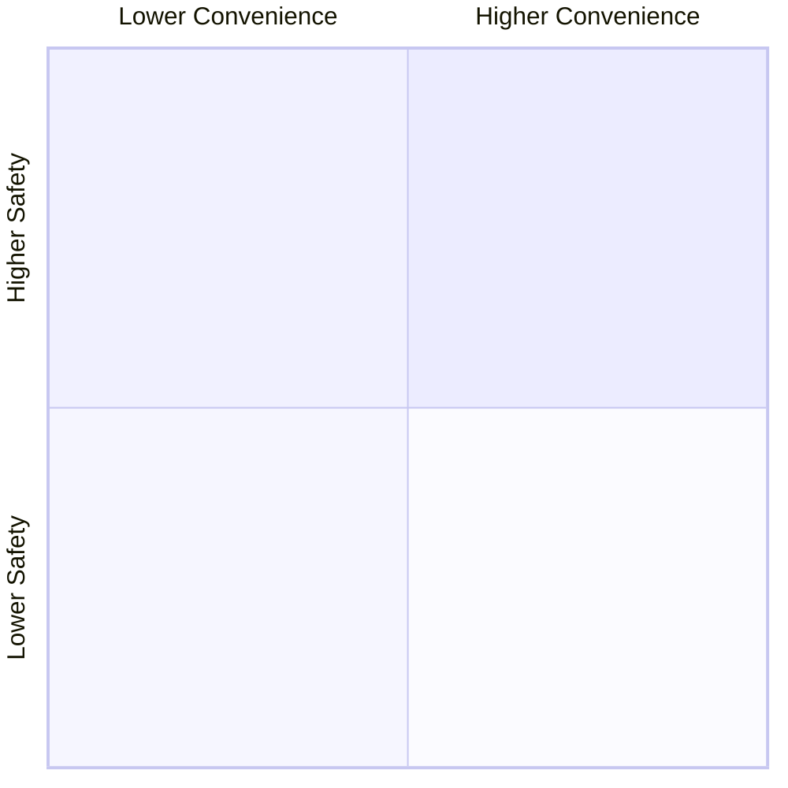
```mermaid {scale: 0.9}
quadrantChart
  x-axis Lower Convenience --> Higher Convenience
  y-axis Lower Safety --> Higher Safety

  classDef scalatra color: #ff3300, radius : 13, stroke-color: #310085, stroke-width: 10px
  classDef akka color: #109060, radius : 8
  classDef http4s color: #f00fff, radius : 8
  classDef tapir color: #F99111
```

::right::

<!--
In case of Scalatra, we can see a lot of benefits in both categories. I'd say it's very convenient to use and very safe, who's with me?
-->

---
layout: two-cols-header
---

# Convenience vs Safety: <span color='#ff3300'>Scalatra</span>


::left::

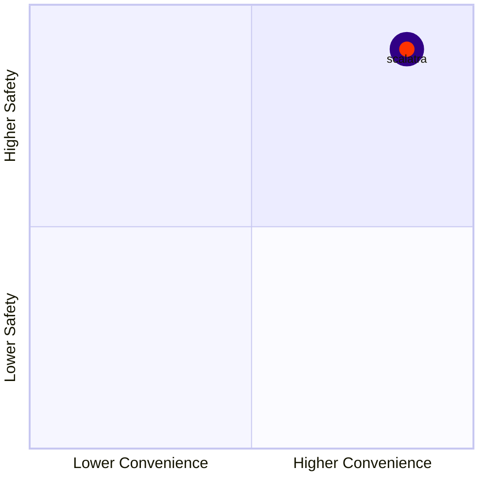
```mermaid {scale: 0.9}
quadrantChart
  x-axis Lower Convenience --> Higher Convenience
  y-axis Lower Safety --> Higher Safety
  scalatra:::scalatra: [0.85, 0.9]

  classDef scalatra color: #ff3300, radius : 13, stroke-color: #310085, stroke-width: 10px
  classDef akka color: #109060, radius : 8
  classDef http4s color: #f00fff, radius : 8
  classDef tapir color: #F99111
```

::right::

- everything in one place <tabler-thumb-up-filled/>
- easy to quickly write something that works <tabler-thumb-up-filled/>
- based on well-tested tech (servlets) <tabler-thumb-up-filled/>
- many stable integrations <tabler-thumb-up-filled/>

<!--
In case of Scalatra, we can see a lot of benefits in both categories. I'd say it's very convenient to use and very safe, who's with me?
-->

---
layout: two-cols-header
---

# Convenience vs Safety: <span color='#ff3300'>Scalatra</span>


::left::

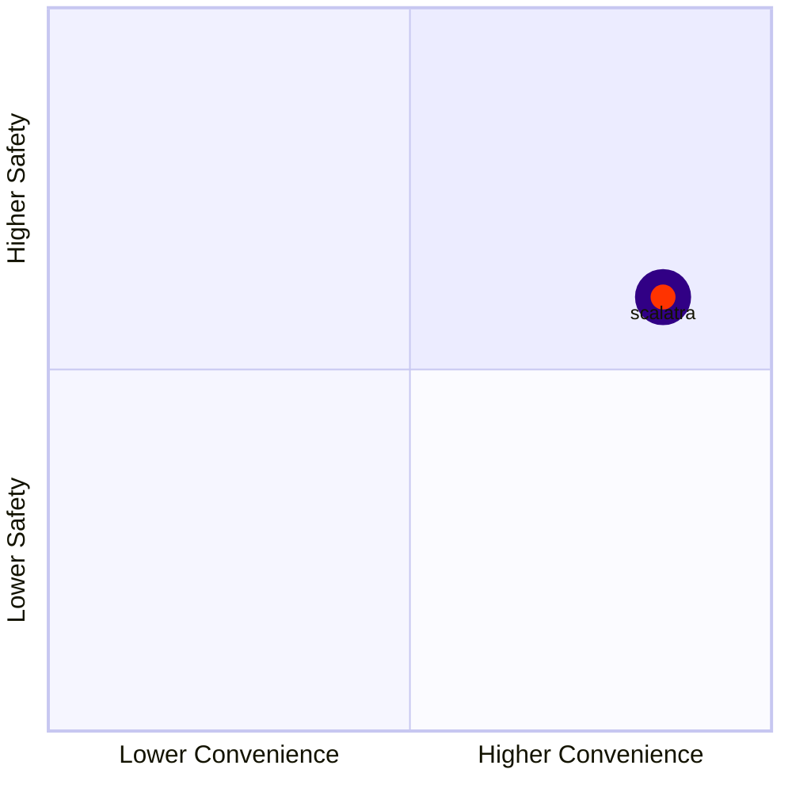
```mermaid {scale: 0.9}
quadrantChart
  x-axis Lower Convenience --> Higher Convenience
  y-axis Lower Safety --> Higher Safety
  scalatra:::scalatra: [0.85, 0.6]

  classDef scalatra color: #ff3300, radius : 13, stroke-color: #310085, stroke-width: 10px
  classDef akka color: #109060, radius : 8
  classDef http4s color: #f00fff, radius : 8
  classDef tapir color: #F99111
```

::right::

- deploying servlets <tabler-thumb-down/>

<!--
-->

---
layout: two-cols-header
---

# Convenience vs Safety: <span color='#ff3300'>Scalatra</span>


::left::

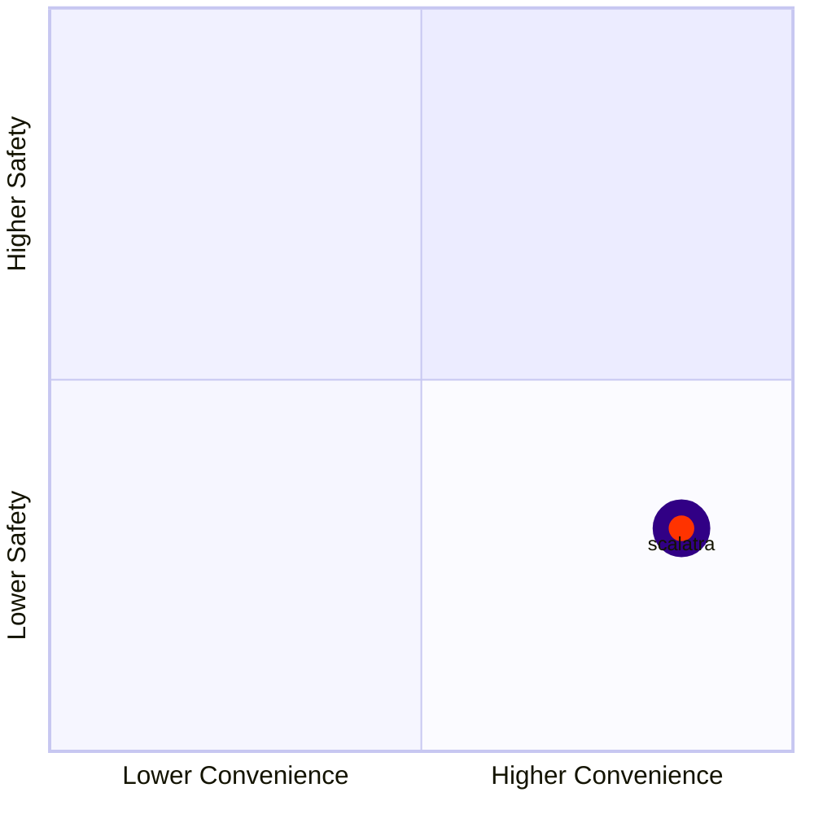
```mermaid {scale: 0.9}
quadrantChart
  x-axis Lower Convenience --> Higher Convenience
  y-axis Lower Safety --> Higher Safety
  scalatra:::scalatra: [0.85, 0.3]

  classDef scalatra color: #ff3300, radius : 13, stroke-color: #310085, stroke-width: 10px
  classDef akka color: #109060, radius : 8
  classDef http4s color: #f00fff, radius : 8
  classDef tapir color: #F99111
```

::right::

- deploying servlets <tabler-thumb-down/>
- in bigger apps: hard to write something that works correctly <tabler-thumb-down/>

<!--
-->

---
layout: two-cols-header
---

# Convenience vs Safety: <span color='#ff3300'>Scalatra</span>


::left::

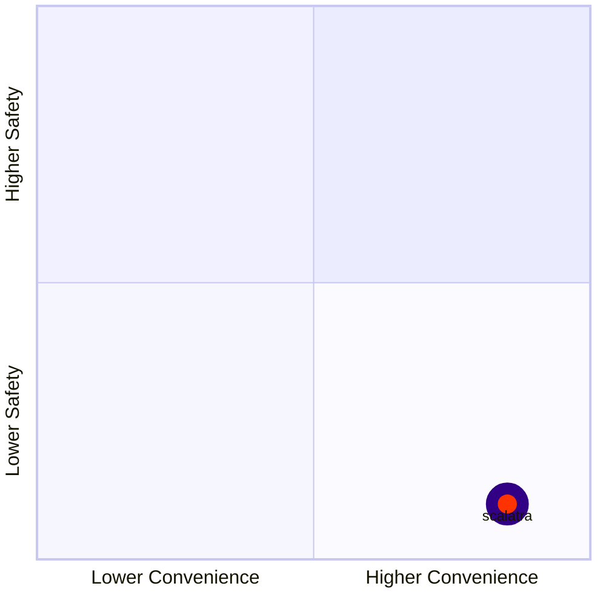
```mermaid {scale: 0.9}
quadrantChart
  x-axis Lower Convenience --> Higher Convenience
  y-axis Lower Safety --> Higher Safety
  scalatra:::scalatra: [0.85, 0.1]

  classDef scalatra color: #ff3300, radius : 13, stroke-color: #310085, stroke-width: 10px
  classDef akka color: #109060, radius : 8
  classDef http4s color: #f00fff, radius : 8
  classDef tapir color: #F99111
```

::right::

- deploying servlets <tabler-thumb-down/>
- in bigger apps: hard to write something that works correctly <tabler-thumb-down/>
- testing is difficult <tabler-thumb-down/>

<!--
-->

---

# Is this the way?


<!--
That's why safety started to be the top priority among many of us. We wanted to be safer in bigger projects, making changes with more confidence, having a more stable dev environments. So, in a way we wanted another type of convenience, a long-term one. And that means, we needed to separate the concerns, decouple things that shouldn't be coupled together.

Not all tools encouraged this which unfortunately created some friction.
-->

---

# Meanwhile... more asynchrony

<div class="absolute top-30 left-40 flex flex-col items-center p-7 rounded-2xl bg-black shadow-xl w-100">
  <div class="flex">
    <span class="text-2xl font-medium text-white">Futures everywhere</span>
  </div>
  <div>
    
  </div>
</div>

<!--
Additionally, as we previously talked about, Futures and asynchrony gained a lot of traction. Everything needed to be asynchronous.

Why not use their inherent asynchrony to run HTTP servers? Scalatra supported Futures, but many devs moved to something else.
-->

---

# Meanwhile... actors

<div class="absolute top-30 left-40 flex flex-col items-center p-7 rounded-2xl bg-black shadow-xl w-100">
  <div class="flex">
    <span class="text-2xl font-medium text-white"><strike>Futures</strike> actors everywhere</span>
  </div>
  <div>
    
  </div>
</div>

<!--
Since people started using actors to design their asynchronous systems, they also wanted their HTTP servers to run on actors.

Why not use their inherent asynchrony to run HTTP servers?
-->

---

# Meanwhile... new DSLs

<div class="absolute top-30 left-40 flex flex-col items-center p-7 rounded-2xl bg-black shadow-xl w-100">
  <div class="flex">
    <span class="text-2xl font-medium text-white">New DSLs everywhere</span>
  </div>
  <div>
    
  </div>
  <div class="flex">
    <span class="text-l font-medium text-gray">(Scala devs love DSLs)</span>
  </div>
</div>


<!--
and that meant we were able to create a new DSL for HTTP along the way!
-->

---

# New paradigm = New DSL

<<< ../projects/pekko-http/src/main/scala/routes.scala#route scala {*|1|2-4|6-7|5-8,9-13}

<div v-click="3">
  <div class="absolute top-58 right-30 w-110 text-red-500 font-bold text-2xl text-center">Actors + Futures</div>
</div>

<!--
That's how akka-http route definition looks like for our example artists app.

[click] The important bit is an endpoint became just a value which was something that helped with composability and readability. You can reason about values, in Scalatra you were calling methods that added endpoints to the servlet state. So that was much better already.

[click] That's how you define path, get request and, most importantly, parameters which are then extracted as function parameters with correct types.

[click] Then, you ask an actor that internally may send messages to other actors and do the fetching/parsing...

[click] we can make decisions based on what is returned. So, domain errors are decoupled from HTTP errors. 

And that's the new DSL. Just by doing that, we were able to quickly integrate the asynchronous actor-based systems with the HTTP layer.
-->

---
layout: two-cols-header
---

# Convenience vs Safety: <span color='#109060'>akka-http</span>


::left::

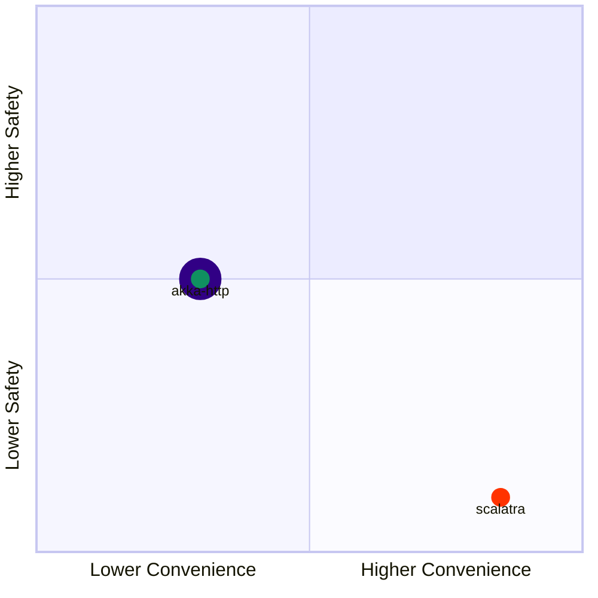
```mermaid {scale: 0.9}
quadrantChart
  x-axis Lower Convenience --> Higher Convenience
  y-axis Lower Safety --> Higher Safety
  scalatra:::scalatra: [0.85, 0.1]
  akka-http:::akka: [0.3, 0.5]

  classDef scalatra color: #ff3300, radius : 8
  classDef akka color: #109060, radius : 13, stroke-color: #310085, stroke-width: 10px
  classDef http4s color: #f00fff, radius : 8
  classDef tapir color: #F99111
```

::right::

- endpoints as values <tabler-thumb-up-filled/>

<!--
-->

---
layout: two-cols-header
---

# Convenience vs Safety: <span color='#109060'>akka-http</span>


::left::

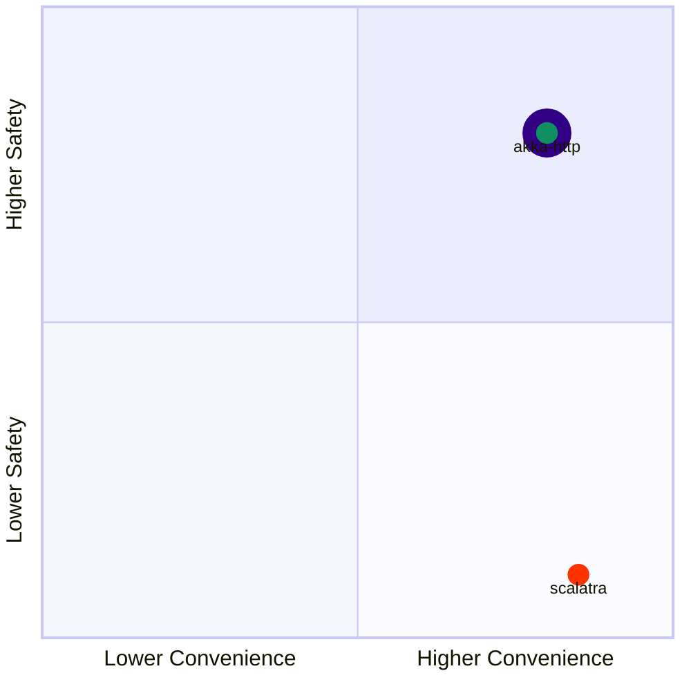
```mermaid {scale: 0.9}
quadrantChart
  x-axis Lower Convenience --> Higher Convenience
  y-axis Lower Safety --> Higher Safety
  scalatra:::scalatra: [0.85, 0.1]
  akka-http:::akka: [0.8, 0.8]

  classDef scalatra color: #ff3300, radius : 8
  classDef akka color: #109060, radius : 13, stroke-color: #310085, stroke-width: 10px
  classDef http4s color: #f00fff, radius : 8
  classDef tapir color: #F99111
```

::right::

- endpoints as values <tabler-thumb-up-filled/>
- concurrency using actors <tabler-thumb-up-filled/>

<!--
-->

---
layout: two-cols-header
---

# Convenience vs Safety: <span color='#109060'>akka-http</span>


::left::

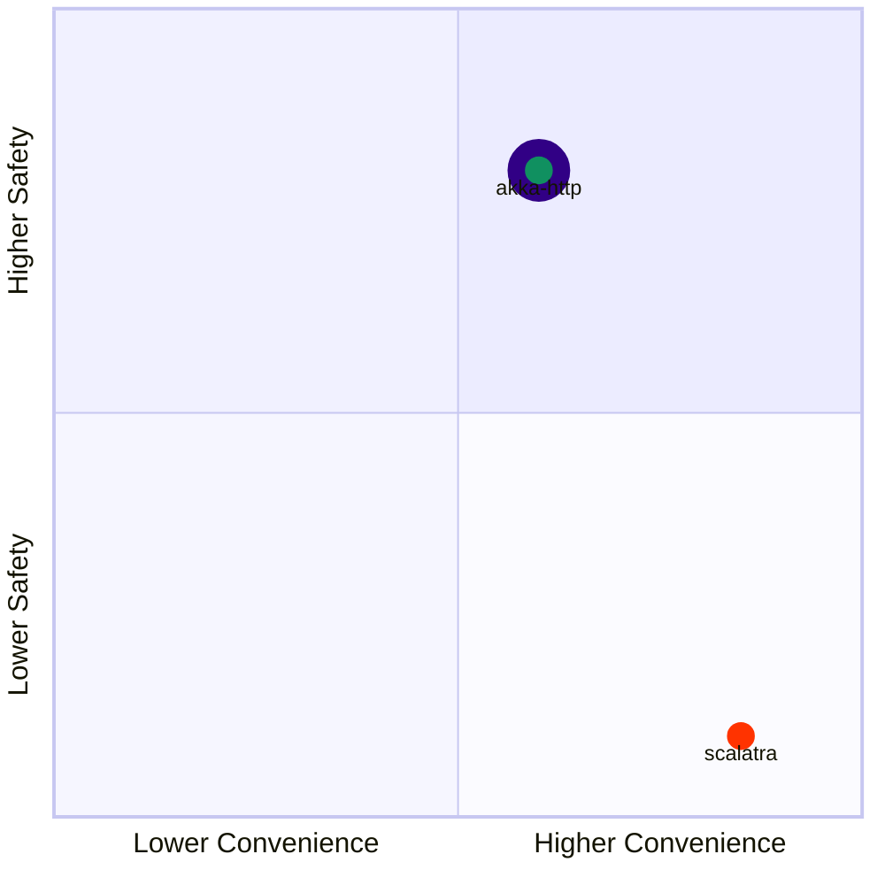
```mermaid {scale: 0.9}
quadrantChart
  x-axis Lower Convenience --> Higher Convenience
  y-axis Lower Safety --> Higher Safety
  scalatra:::scalatra: [0.85, 0.1]
  akka-http:::akka: [0.6, 0.8]

  classDef scalatra color: #ff3300, radius : 8
  classDef akka color: #109060, radius : 13, stroke-color: #310085, stroke-width: 10px
  classDef http4s color: #f00fff, radius : 8
  classDef tapir color: #F99111
```

::right::

- endpoints as values <tabler-thumb-up-filled/>
- concurrency using actors <tabler-thumb-up-filled/>
- actors' code navigation <tabler-thumb-down/>

<!--
-->

---
layout: two-cols-header
---

# Convenience vs Safety: <span color='#109060'>akka-http</span>


::left::

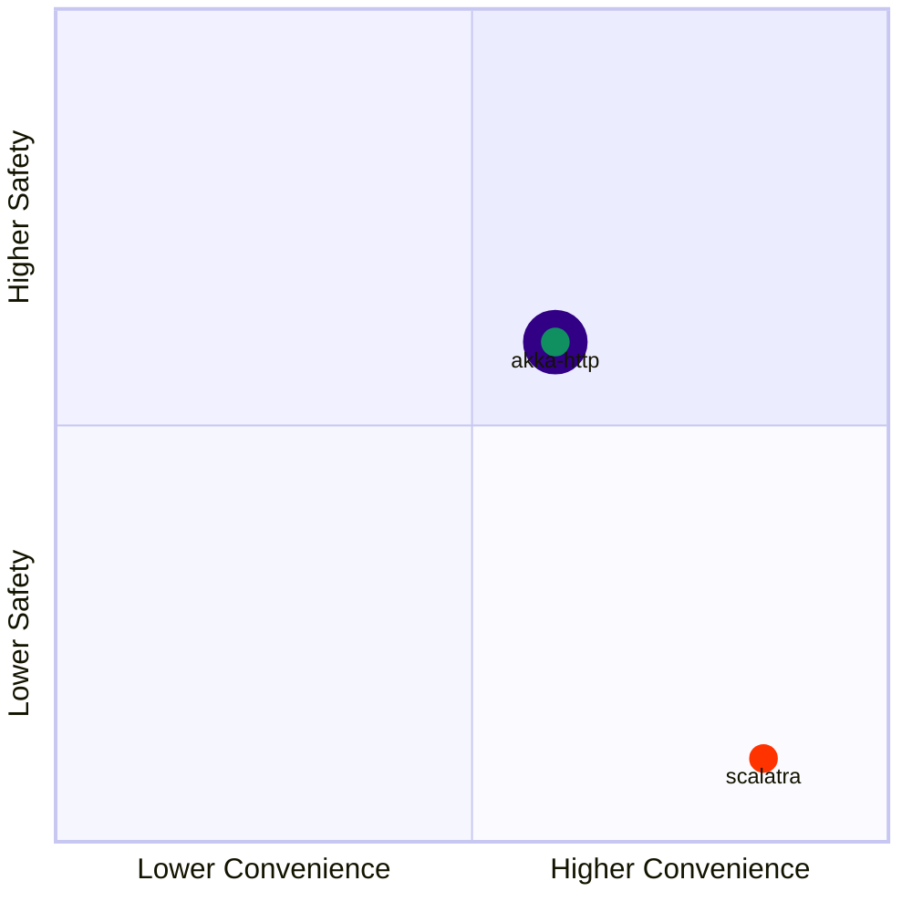
```mermaid {scale: 0.9}
quadrantChart
  x-axis Lower Convenience --> Higher Convenience
  y-axis Lower Safety --> Higher Safety
  scalatra:::scalatra: [0.85, 0.1]
  akka-http:::akka: [0.6, 0.6]

  classDef scalatra color: #ff3300, radius : 8
  classDef akka color: #109060, radius : 13, stroke-color: #310085, stroke-width: 10px
  classDef http4s color: #f00fff, radius : 8
  classDef tapir color: #F99111
```

::right::

- endpoints as values <tabler-thumb-up-filled/>
- concurrency using actors <tabler-thumb-up-filled/>
- actors' code navigation <tabler-thumb-down/>
- `Future`s are eagerly evaluated <tabler-thumb-down/>

<!--
-->

---
layout: two-cols-header
---

# Convenience vs Safety: <span color='#109060'>akka-http</span>


::left::

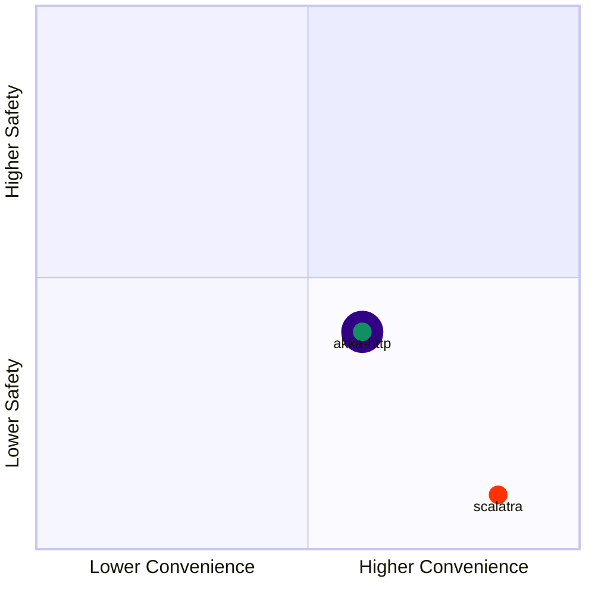
```mermaid {scale: 0.9}
quadrantChart
  x-axis Lower Convenience --> Higher Convenience
  y-axis Lower Safety --> Higher Safety
  scalatra:::scalatra: [0.85, 0.1]
  akka-http:::akka: [0.6, 0.4]

  classDef scalatra color: #ff3300, radius : 8
  classDef akka color: #109060, radius : 13, stroke-color: #310085, stroke-width: 10px
  classDef http4s color: #f00fff, radius : 8
  classDef tapir color: #F99111
```

::right::

- endpoints as values <tabler-thumb-up-filled/>
- concurrency using actors <tabler-thumb-up-filled/>
- actors' code navigation <tabler-thumb-down/>
- `Future`s are eagerly evaluated <tabler-thumb-down/>
- `Future` is too powerful <tabler-thumb-down/>

<!--
-->

---

# Future to IO to tagless final

```scala
def findArtist(name: String): Future[Either[ArtistNotFound, Artist]]
```

<v-click>
<center><hugeicons-square-arrow-down-02/></center>
```scala
def findArtist(name: String): IO[Either[ArtistNotFound, Artist]]
```
</v-click>

<v-click>
<center><hugeicons-square-arrow-down-02/></center>
```scala
def findArtist(name: String): IO[Artist]
```
</v-click>

<v-click>
<center><hugeicons-square-arrow-down-02/></center>
```scala
def findArtist[F[_]](name: String)(implicit ME: MonadThrow[F]): F[Artist]
```
</v-click>

<!-- 
We know that IO's are lazily evaluated, just values holding the description of the program to be executed. Many people just switched to IO.

IO is much better than Future, allows structured concurrency.

[click] But we still wanted to be able to decouple the domain errors with HTTP or other representation errors so Either must stay, which would present us exactly the same problem as we had with Futures of Eithers. This setup wasn't that easy to use in call-site. 

We could use EitherT with IOs here but that would mean we'd need to work with monads wrapping other monads, spraying it all over our apps. Some people did that but many others chose to be more pragmatic and focus on convenience by...

[click] hiding the error inside IO, keeping the signature clean. Again this was a tradeoff: more convenience at the cost of less safety. Errors were no longer explicit. The call site needed to know what kind of errors can be thrown.

We were able to solve some convenience and safety problems. It's easier to work with IO than with monad transformers. It's lazily evaluated but one problem remained the same as in Futures: these types are too powerful: you can do everything in a function that returns an IO.

We wanted to mark our internal functions with just the right amount of constraints, so that only the thing that we allow can happen. In the case of our dummy findArtist simulation it can just throw an error: either a domain error or a serialization error.

[click] That's were the tagless final approach went in. We can mark the function as returning an Artist inside a value of a type that can also hold some error information. The type is going to be chosen by somebody else at the final call site.
-->
---

# IOs and final tagless

<div class="absolute top-30 left-40 flex flex-col items-center p-7 rounded-2xl bg-black shadow-xl w-110">
  <div class="flex">
    <span class="text-2xl font-medium text-white">IOs and final tagless everywhere</span>
  </div>
  <div>
    
  </div>
</div>

<!--
We also have a good way of constraining the function return types and using IO to interpret the programs at the end of the world.
-->

---

# New paradigm = New DSL

<div class="absolute top-30 left-40 flex flex-col items-center p-7 rounded-2xl bg-black shadow-xl w-100">
  <div class="flex">
    <span class="text-2xl font-medium text-white">New DSLs everywhere</span>
  </div>
  <div>
    
  </div>
  <div class="flex">
    <span class="text-l font-medium text-gray">(Scala devs love DSLs)</span>
  </div>
</div>


<!--
and that of course meant we needed new DSLs for HTTP
-->

---

# New paradigm = New DSL

<<< ../projects/http4s/src/main/scala/example/Collaboration.scala#interface scala {*}

<!--
New DSL for HTTP was a tool called http4s which embraced the new way of develping apps. It pushed Scala devs to decouple the server logic implementation from the endpoint definition using the tagless final approach. So, to create an HTTP server for our example, we first need to define the server logic signature.
-->

---

# New paradigm = New DSL

<<< ../projects/http4s/src/main/scala/example/Collaboration.scala#interface scala {*}

<<< ../projects/http4s/src/main/scala/example/Routes.scala#route scala {*}

<!--
Then we could define the endpoints using the new HTTP DSL.
-->

---

# http4s + final tagless

<<< ../projects/http4s/src/main/scala/example/Collaboration.scala#interface scala {*}

<<< ../projects/http4s/src/main/scala/example/Routes.scala#route scala {*}

<<< ../projects/http4s/src/main/scala/example/Collaboration.scala#impl scala {*}

<!--
And finally, we could implement the server logic in separation from the HTTP endpoints.

That's how http4s route definition looked like. It was all functional, abstracted away, decisions about the final interpretation type delayed until the last moment.

And that's the new DSL. Was it the holy grail? it turns out, not really... we still search for better techniques. Why?
-->

---
layout: two-cols-header
---

# Convenience vs Safety: <span color='#f00fff'>http4s</span>


::left::

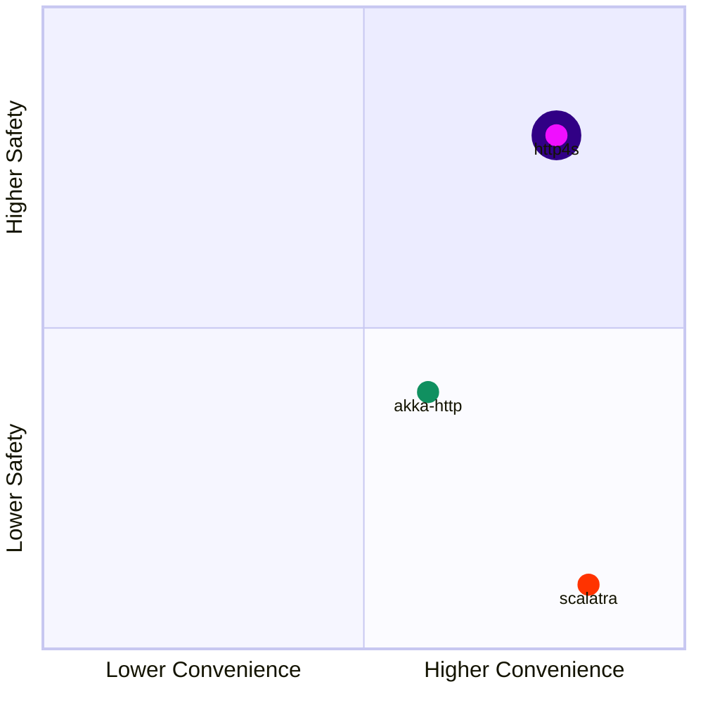
```mermaid {scale: 0.8}
quadrantChart
  x-axis Lower Convenience --> Higher Convenience
  y-axis Lower Safety --> Higher Safety
  scalatra:::scalatra: [0.85, 0.1]
  akka-http:::akka: [0.6, 0.4]
  http4s:::http4s: [0.8, 0.8]

  classDef scalatra color: #ff3300, radius : 8
  classDef akka color: #109060, radius : 8
  classDef http4s color: #f00fff, radius : 13, stroke-color: #310085, stroke-width: 10px
  classDef tapir color: #F99111, radius : 8
```

::right::

- fine-grained control <tabler-thumb-up-filled/>
- structured concurrency <tabler-thumb-up-filled/>
- lazy evaluation <tabler-thumb-up-filled/>

<!--
We were able to solve some convenience and safety problems. It's easier to work with IO than with monad transformers. It's lazily evaluated but one problem remained the same as in Futures: these types are too powerful: you can do everything in a function that returns an IO.
-->

---
layout: two-cols-header
---

# Convenience vs Safety: <span color='#f00fff'>http4s</span>


::left::

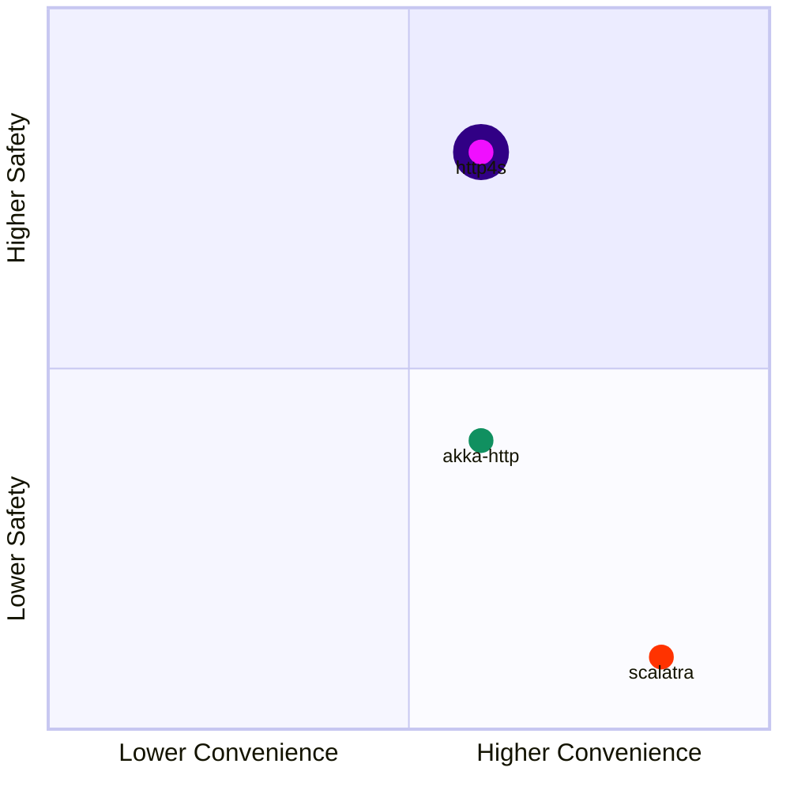
```mermaid {scale: 0.8}
quadrantChart
  x-axis Lower Convenience --> Higher Convenience
  y-axis Lower Safety --> Higher Safety
  scalatra:::scalatra: [0.85, 0.1]
  akka-http:::akka: [0.6, 0.4]
  http4s:::http4s: [0.6, 0.8]

  classDef scalatra color: #ff3300, radius : 8
  classDef akka color: #109060, radius : 8
  classDef http4s color: #f00fff, radius : 13, stroke-color: #310085, stroke-width: 10px
  classDef tapir color: #F99111, radius : 8
```

::right::

- fine-grained control <tabler-thumb-up-filled/>
- structured concurrency <tabler-thumb-up-filled/>
- lazy evaluation <tabler-thumb-up-filled/>
- large, complicated signatures <tabler-thumb-down/>

<!--
-->

---
layout: two-cols-header
---

# Convenience vs Safety: <span color='#f00fff'>http4s</span>


::left::

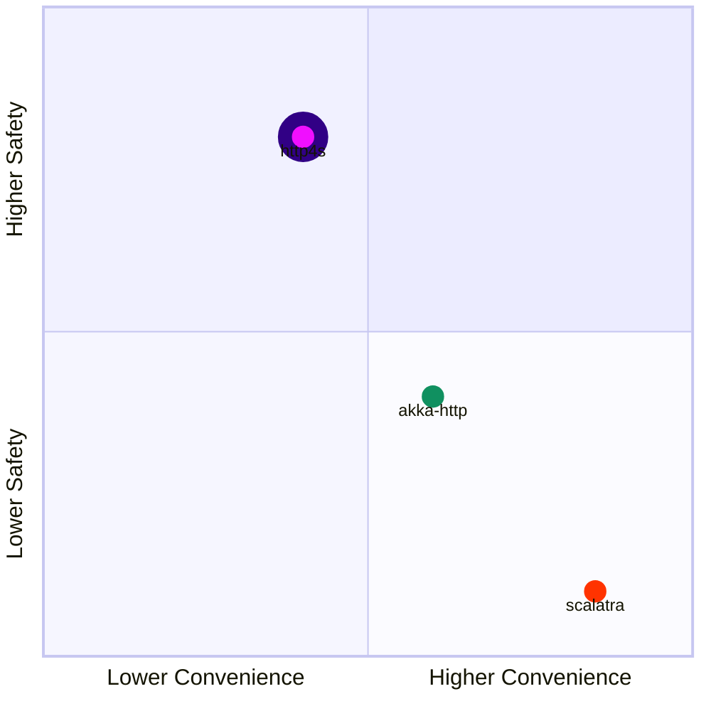
```mermaid {scale: 0.8}
quadrantChart
  x-axis Lower Convenience --> Higher Convenience
  y-axis Lower Safety --> Higher Safety
  scalatra:::scalatra: [0.85, 0.1]
  akka-http:::akka: [0.6, 0.4]
  http4s:::http4s: [0.4, 0.8]

  classDef scalatra color: #ff3300, radius : 8
  classDef akka color: #109060, radius : 8
  classDef http4s color: #f00fff, radius : 13, stroke-color: #310085, stroke-width: 10px
  classDef tapir color: #F99111, radius : 8
```

::right::

- fine-grained control <tabler-thumb-up-filled/>
- structured concurrency <tabler-thumb-up-filled/>
- lazy evaluation <tabler-thumb-up-filled/>
- large, complicated signatures <tabler-thumb-down/>
- viral signature changes <tabler-thumb-down/>

<!--
-->

---
layout: two-cols-header
---

# Convenience vs Safety: <span color='#f00fff'>http4s</span>


::left::

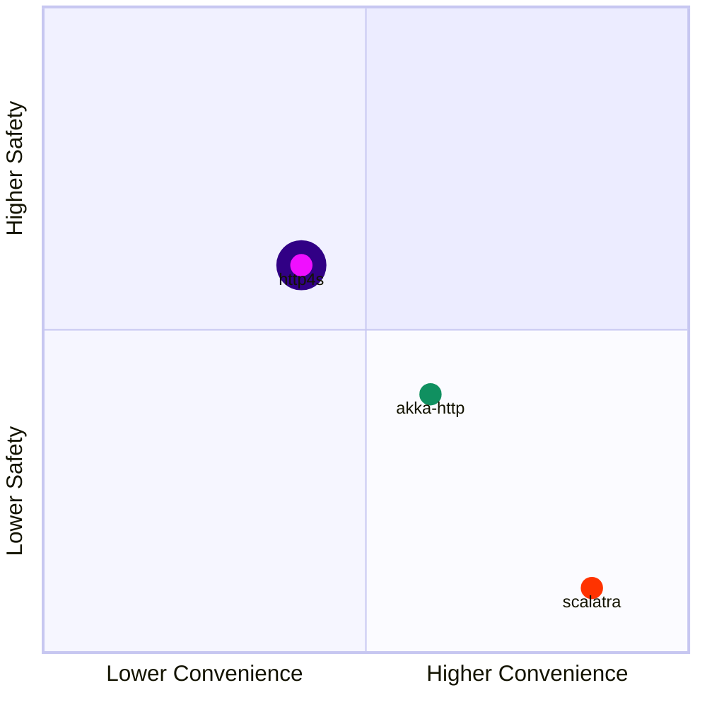
```mermaid {scale: 0.8}
quadrantChart
  x-axis Lower Convenience --> Higher Convenience
  y-axis Lower Safety --> Higher Safety
  scalatra:::scalatra: [0.85, 0.1]
  akka-http:::akka: [0.6, 0.4]
  http4s:::http4s: [0.4, 0.6]

  classDef scalatra color: #ff3300, radius : 8
  classDef akka color: #109060, radius : 8
  classDef http4s color: #f00fff, radius : 13, stroke-color: #310085, stroke-width: 10px
  classDef tapir color: #F99111, radius : 8
```

::right::

- fine-grained control <tabler-thumb-up-filled/>
- structured concurrency <tabler-thumb-up-filled/>
- lazy evaluation <tabler-thumb-up-filled/>
- large, complicated signatures <tabler-thumb-down/>
- viral signature changes <tabler-thumb-down/>
- too powerful `F[_]: Sync` <tabler-thumb-down/>

<!--
-->

---

# What we wanted


<!--
When we started the journey many years ago, we had a lot of convenience but not much safety. We embarked on a long journey, trying to use many different tools, always making a leap forward. We wanted more safety.

We got safety, but along the way, we alos got a lot of inconvenience. You usually can't have both. Can we?
-->

---

# We still learned a lot

- immutable values are cool
- pure functions are cool
- expressive types are cool
- lazy evaluation is cool

<!-- 
Couldn't we just use this as a basis and let programmers choose their own poison for the other aspects?
-->

---

# Enter tapir

<<< ../projects/tapir/src/main/scala/example/endpoints.scala#endpoint scala {*}

<v-click>

<span class="absolute top-30 right-20 text-4xl font-bold bg-white text-black rotate-5">just a value</span>

</v-click>

<!-- 
That's how tapir gained a lot of traction and stole many Scala developers' hearts. It's a result of getting all the experience we discussed so far and putting it to practice using the foundational Scala FP advantages: values and functions.

[click] So, an endpoint is just a value.
-->

---

# Enter tapir

<<< ../projects/tapir/src/main/scala/example/endpoints.scala#impl scala {*}

<span class="absolute top-30 right-20 text-4xl font-bold bg-white text-black rotate-5">just a function</span>

<!-- 
server logic is just a function
-->

---

# Enter tapir

<<< ../projects/tapir/src/main/scala/example/Server.scala#app scala {*|10|4}

<div v-click="2">

  <span class="absolute top-30 right-20 text-4xl font-bold bg-white text-black rotate-5">pick any server!</span>

</div>

<!-- 
and the whole app is just another IO value

[click] we just use the endpoint value here to make sure the endpoint is server by the server

[click] and finally note how we use a Netty server here, tapir allows us to use any backends and effect types, cats IO, ZIO, actors using pekko and many more. You can choose your own poison.
-->

---
layout: two-cols-header
---

# Convenience vs Safety: <span style="color: #F99111;">tapir</span>


::left::

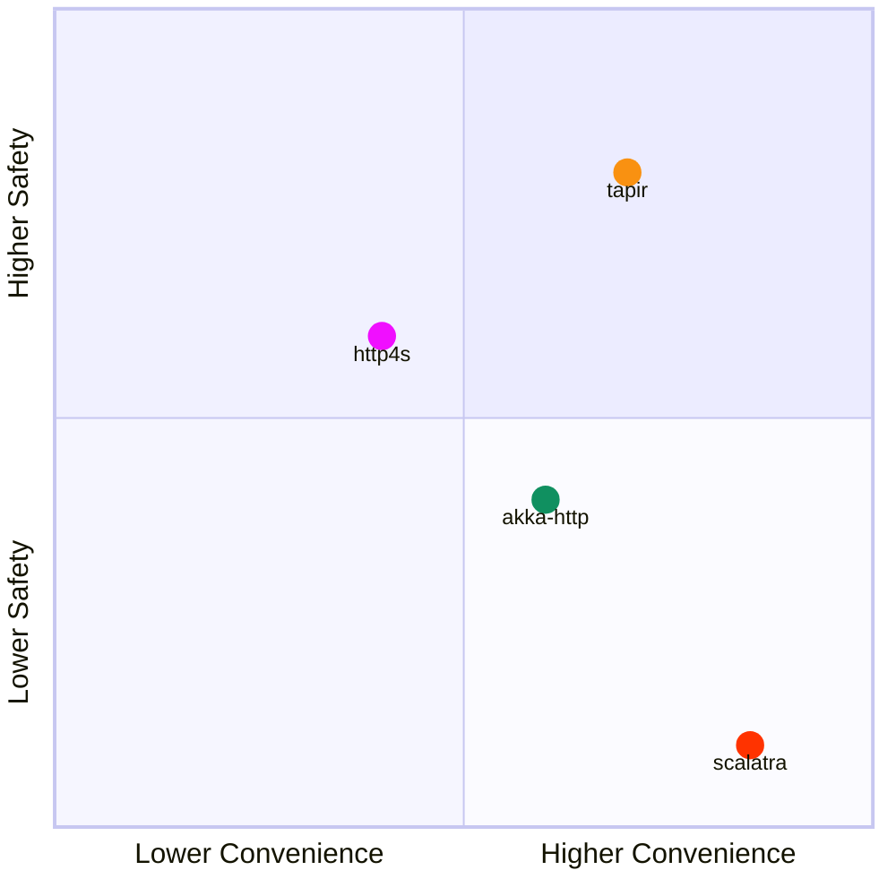
```mermaid {scale: 0.9}
quadrantChart
  x-axis Lower Convenience --> Higher Convenience
  y-axis Lower Safety --> Higher Safety
  scalatra:::scalatra: [0.85, 0.1]
  akka-http:::akka: [0.6, 0.4]
  http4s:::http4s: [0.4, 0.6]
  tapir:::tapir: [0.7, 0.8]

  classDef scalatra color: #ff3300, radius : 8
  classDef akka color: #109060, radius : 8
  classDef http4s color: #f00fff, radius : 8
  classDef tapir color: #F99111, radius : 8
  classDef play color: #92d13d, radius : 13, stroke-color: #310085, stroke-width: 10px
```

::right::

- immutable values <tabler-thumb-up-filled/>
- pure functions <tabler-thumb-up-filled/>
- a lot of stable integrations <tabler-thumb-up-filled/>
- HTTP-specific domain modeled using types <tabler-thumb-up-filled/>

<!--
Since you can choose what's the design of your app, you can use anything and it will integrate well.
-->

---

# What the `F[_]`

Let's go back to this question

Do we really need `F[_]: Async: Monad: Clock: UUIDGen` to create **safe** applications?


<v-click>

<div class="absolute bottom-2 right-20 text-2xl bg-white text-black rotate-5 border-solid border-white border-10">

Featuring

✅ Testability

✅ Composability

✅ Choice

❌ Readability

❌ Cognitive load


</div>

</v-click>


<!--
Scala developers pursued safety, but it turned out it was at the cost of convenience, especially for new joiners.

small abstract: Since the beginning, Scala devs have been pursuing more ergonomic ways of building software. Even in 2025, we are still not satisfied with what we have, we still believe we could do better. Maybe the problem is not in the language, but in us?
-->
